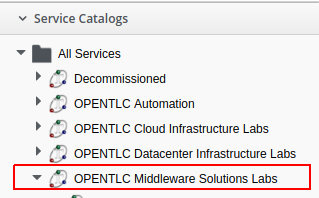
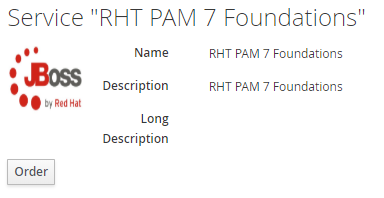
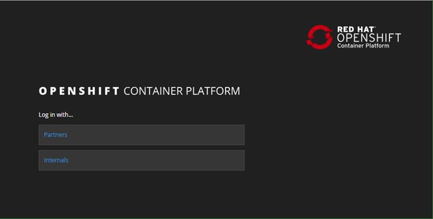
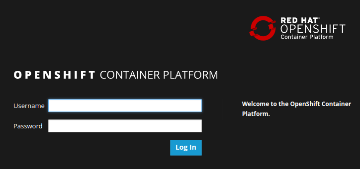
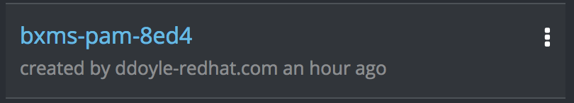
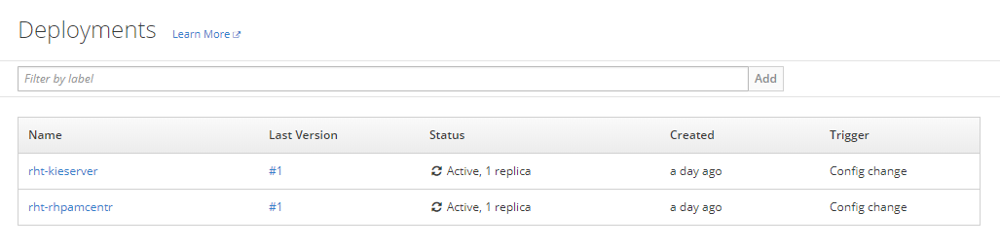
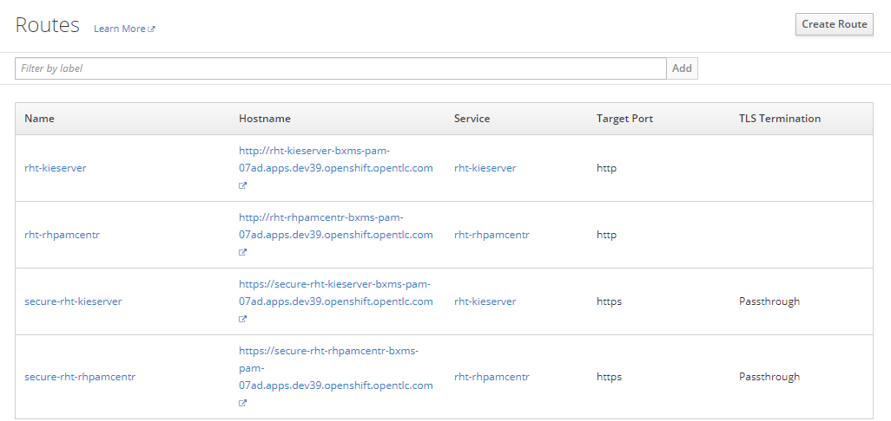
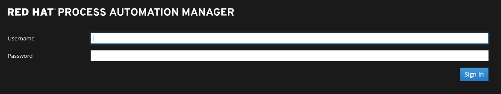
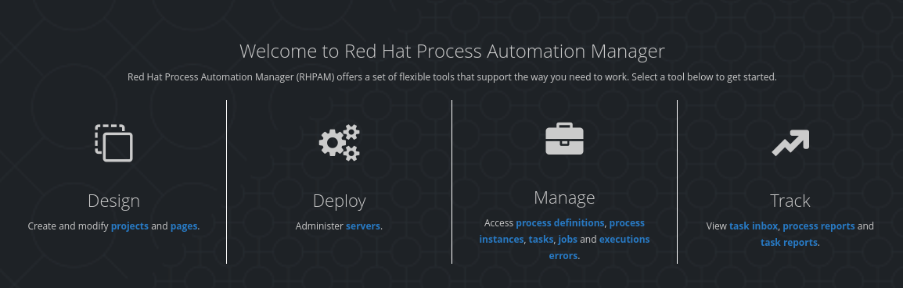

:scrollbar:

:toc2:
:bpmsuite_template: link:https://raw.githubusercontent.com/gpe-mw-training/bxms_decision_mgmt_foundations_lab/master/bpmsuite70-full-mysql.json[BPM Suite Template]
:linkattrs:

== Environment Setup Lab

In this lab, you use Red Hat OpenShift Container Platform to provision a Business Central environment. You use this environment to create your business assets.

.Goals
* Order a Red Hat Process Automation Manager lab environment
* Log in to the Business Central web application

.Prerequisites
* Broadband Internet connectivity
* An up-to-date browser such as Google Chrome or Firefox
* Red Hat Online Partner Enablement Network--Training Learning Center (OPENTLC) credentials

:numbered:

== Set Up Red Hat Process Automation Manager Environment

In this section, you first register for the ability to create a project in your remote OpenShift lab environment. Then, you order a Red Hat Process Automation Manager lab environment from a catalog entry in a Red Hat CloudForms environment administered by the OPEN team.

. In your browser, navigate to the link:https://labs.opentlc.com/[OPENTLC lab portal]:
+
image::images/cf_login.png[]

. Enter your OPENTLC username and password, and click *Login*.
. Navigate to *Services -> Catalogs -> OPENTLC Middleware Solutions Labs*:
+

. Select *RHT PAM 7 Foundations* and click *Order*:
+

. In the next panel, click *Submit* in the lower right corner.
* This initiates the provisioning of a full Red Hat Process Automation Manager lab environment. This lab environment is provisioned in a Red Hat OpenShift Container Platform (RHOCP) cloud environment administered by Red Hat's OPEN team.

* Within 5 to 10 minutes, expect to receive an email indicating that the provisioning request was completed.
** This email confirms that your Red Hat Process Automation Manager project is created.

. Make a note of the following information provided in the email:

* *GUID*: Your unique identifier, such as `05c4`.
** When you see `$GUID` or `GUID` in the lab instructions, replace it with your unique identifier specified in the email.
* *Environment URL*: The URL for the shared OpenShift Container Platform master node where your lab environment is hosted, such as `https://master.na39.openshift.opentlc.com`.
** This URL includes a specific region value. In this example, the region is `na39`. When you see `$REGION` in the lab instructions, replace it with the region value specified in the email you received.

. Save the email.
* You need the GUID and Environment URL for use throughout the course.

== Log In to OpenShift Container Platform Web Console

. Using a web browser, navigate to the URL of the OpenShift Container Platform master node mentioned in the email.

. On the first OpenShift Container Platform login page, click *Partners*:
+

. On the *Welcome to the OpenShift Container Platform* page, log in using your OPENTLC credentials:
+

* When you log in, expect to see the available projects in the right-hand panel of the home page.

. Select the project with the name similar to `bxms-pam-$GUID`:
+

* The *Overview* page for the project is displayed.

=== Explore Deployments

. In the left panel, navigate to *Applications -> Deployments*.

. Examine the two deployments and expect to see that they both have a status of `Active, 1 replica`:
+

. Review the descriptions of each of these applications:
+
[cols="1,4",options="header"]
|=====
| Application Name | Description
|`rht-kieserver` | Process Server component where process execution occurs
|`rht-rhpamcentr` | Business Central component where version-controlled process and rule authoring occurs
|=====

=== Explore Routes
. In the left-hand panel, navigate to *Applications -> Routes*.
. Note the URL to your `rht-rhpamcentr` route:
+

== Log In to Business Central

. Click the `rht-rhpamcentr` route.
* A new tab opens in your browser showing the Business Central web application of Red Hat Process Automation Manager:
+

. Log in using these credentials:
* *Username*: `adminUser`
* *Password*: `test1234!`

. Verify that you see the Business Central home page:
+

== Review Known Issues

Red Hat's engineering team is investigating two known issues--Business Central's long load time and the display of incorrect information.

.Long Load Times

Sometimes Business Central takes a long time to load. You can refresh your browser to make use of your browser cache and improve the load time in subsequent attempts to load the UI.

.Inconsistent State

In some cases, Business Central does not correctly display the expected information on a page after an action or remains in the loading state.

* In this case, you can press *F5* to refresh your browser and reload the Business Central web page.
* When you try the exercise again, you can expect it to work.

.New Process Designer for Mac Users

* For most Mac users, the new Process Designer's performance is slow--you may observe lags when clicking and dragging components during the design process.
* If you experience this problem with macOS, the workaround is to keep using the legacy Process Designer.
