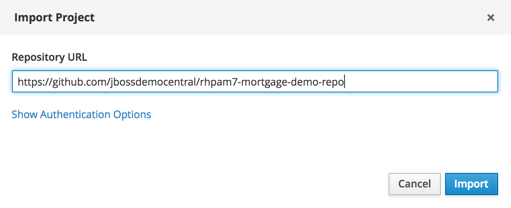
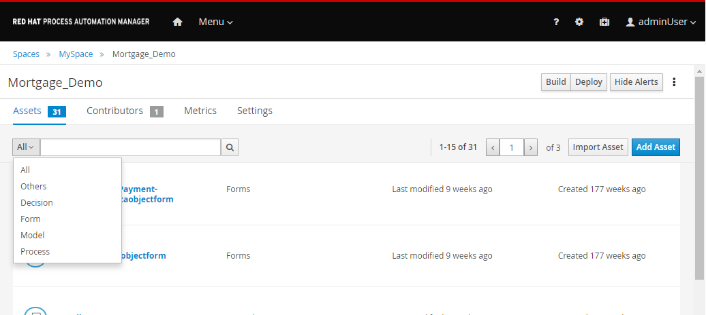

:scrollbar:

:toc2:
:linkattrs:

== Assets Navigation Lab

This lab showcases the Business Central environment provisioned in the previous lab. You retrieve business assets from the `Mortgage_Demo` project, one of the demonstration projects available on link:https://github.com/jbossdemocentral/rhpam7-mortgage-demo-repo[JBoss Demo Central].

In this lab, you import the `Mortgage_Demo` project into the Business Central workbench of Red Hat Process Automation Manager 7. You navigate the project's assets, such as process definitions, rules, and forms, in the project's library. You build and deploy the project to the Process Server, the platform's lightweight runtime engine, after which you start a mortgage application process instance. Finally, you explore the runtime process and task management using the process instance created in the previous step.

.Goals
* Become familiar with business assets and their organization
* Become familiar with the business asset icons and representations
* Search for and open business assets for viewing and editing
* Become familiar with the build and deployment process
* Start a process instance and explore process and task runtime administration

.Prerequisites
* Successful completion of the environment setup lab for this course
* Successful login to Business Central

:numbered:

== Import Project

In this exercise, you import an existing project, the `Mortgage_Demo` project from the https://github.com/jbossdemocentral/rhpam7-mortgage-demo-repo[JBoss Demo Central] GitHub repository.

. Log in to Business Central if you are not already logged in:
.. From the OpenShift Container Platform home page, select the Process Automation Manager project.
.. Navigate to *Applications -> Routes* and select the `rht-rhpamcentr` route.
.. Log in to Business Central using the `adminUser`/`test1234!` credentials.
+
[TIP]
If you need more details, refer back to the first lab in this course.

. Click *Design* from the Business Central home page.
* Alternatively, navigate to *Menu -> Design -> Projects*.
* The *Projects* view displays the available projects in the library. If the library is empty, it displays "Nothing Here":
+

* In an empty *Projects* view, you have the option to create a project, try a sample, or import an existing project.

. Click *Import Project*.
* Expect to see an *Import Project* dialog where you specify a Git repository URL for the project.
. In the *Repository URL* field, enter `https://github.com/jbossdemocentral/rhpam7-mortgage-demo-repo` and click *Import*:
+

. On the *Try Samples* page, select `Mortgage_Demo` and click *OK*.
* When the import is complete, the *Assets* view of the Mortgage_Demo project is displayed:
+

== Navigate Assets View

The *Assets* view shows a tabular list of the assets in the project. From this view, you can:

* Filter assets by type
* Search for assets
* Navigate between pages of assets

=== Filter Assets by Type

. Click *All* in the filter list at the top left of the assets list.
* The list allows you to filter the assets by type:
+

. Try each of the following:
.. Filter by *Process*.
.. Filter by *Decision*.
.. Filter by *Model*.
.. Filter by *Form*.

. When you are done exploring, set the filter to *All*.

=== Search for Assets

To the right of the filter list is a search input field. The grid is filtered by the asset's fully qualified name, and the match is not case-sensitive.

. Enter `gdst` and click  (*Search*):
+

. Repeat the search for each of the following terms:
* `Mortgage`
* `Validate`
. Clear the search field.

=== Navigate Between Pages

At the top right of the assets list, there is a pagination control that allows you to navigate between the pages that comprise the assets list.

. Find the pagination control.
. Navigate to the next page of assets and back.

=== Explore Process Definition

. In the *Assets* view, use the filter list to filter by *Process*.
. Open the *MortageApplication* process.
* This is the process you use for the remainder of this lab.
. In the Process Designer, explore the process and identify the different BPMN2 constructs used, such as Business Rule Task, Human Task, X-OR Gateway, and Swimlane.
. Follow a process path from start to finish and get a high-level understanding of the process semantics.

== Download Project

Projects can be downloaded from Business Central so you can use them to upload to a source code repository and import them later into another instance of Business Central or distribute them outside the environment where they were created.

To download the project, you start from Business Central's home page.

. Click  (*Home*) at the top of the screen to access the Business Central home page.
. Click *Design*.
* Note that the empty *Projects* view you saw earlier is now populated with the Mortgage_Demo project.
. Select the *Mortgage_Demo* project.
* This displays the *Assets* view for the project.
. Select the *Applicant* asset.
* Expect to see the *Model* view with the *Project Explorer* panel open on the left.
+
NOTE: If the *Project Explorer* panel does not open automatically, click  on the left side to open it.
+

+
[NOTE]
====
The *Project Explorer* panel is accessible only when you select an asset from the project's *Asset* view.
====

. Click  in the *Project Explorer* panel and select *Download Project*:
+

* Expect to find a ZIP file called `MySpace_examples-rhpam7-mortgage-demo-repo.zip` in your `Downloads` folder. The filename is structured `[Space Name]-[Repository Name]_[project name].zip`.
+
[NOTE]
In some cases, the file name may be missing the `[Space Name]-` prefix.

== Deploy Mortgage Demonstration Project

It is useful to know how to create an executable component from a project. Executable components are stored in a binary repository (Maven) so that they can be used as dependencies for other projects. Executable components are also distributed to _execution servers_. Execution servers are the runtime containers that allow process execution from the Business Central workbench and client applications.

In this section, you deploy the Mortgage_Demo project and confirm the deployment in OpenShift Container Platform.

The Mortgage_Demo project is a Process Automation Manager project intended to demonstrate the use of Process Server to execute a mortgage application business process.

=== Deploy Project

. Click  (*Home*).
. Click *Design* and select the *Mortgage_Demo* project.
* This shows the project's *Assets* view.
. Click *Deploy* in the upper right.
* Expect to see confirmation of a successful deployment.
. Click  (*Home*).
. Click *Deploy* to display the execution servers.
* This shows the list of servers and containers.
* Alternatively, you can click *Menu -> Deploy -> Execution Servers* to navigate to the server page.

. Verify that the `mortgage_1` KIE container shows a green circle with a checkmark, indicating successful deployment:
+

+
[NOTE]
====
Note that the IP address for the remote server is an internal host IP address for the OpenShift environment. This means that while the IP address is accessible from within the OpenShift platform components, you cannot access this IP address from outside the OpenShift environment--for example, from your browser.
In order to access the KIE containers from outside the OpenShift environment, you need a Process Server route, which you get from the list of pods in OpenShift Container Platform.
====

=== Confirm Deployment

. If you are not already logged in to OpenShift Container Platform, log in now:
.. Using a web browser, navigate to the URL of the OpenShift Container Platform master node mentioned in the lab confirmation email.
.. On the first OpenShift Container Platform login page, click *Partners*.
.. On the *Welcome to the OpenShift Container Platform* page, log in using your OPENTLC credentials.
+
[TIP]
If you need more details, refer back to the first lab in this course.
. Select the Process Automation Manager project from your project list:
+
image::images/projects-list.png[]

. On the *Overview* page, locate the Process Server deployment whose name begins with `rht-kieserver` in the list and click the *>* icon to the left to display details of this deployment:
+

. From the *Networking* section of the Process Server pod, select one of the entries under *Routes - External Traffic* and open the link in a new window.
* By default the Process Server route needs additional details about the information that you are requesting, so expect to see a *Forbidden* message appear:
+

. Add `/docs` to the end of the URL in your browser.
* Expect to see the KIE server remote API reference documentation:
+

. Navigate to the **KIE Server :: Core** section.
. Click the **GET /server/containers** entry to expand the section.
. Click *Try it out* on the right.
. Leave all of the fields empty and click *Execute*.
+
[NOTE]
====
The Process Server RESTful endpoints are _secured resources_. This means that you need to present credentials to access the resources--for example, when you click *Execute* in the API documentation. You use the same credentials (`adminUser`/`test1234!`) that you use for accessing Business Central.
====

. Review the *Server response* section and verify that it shows the response confirming the existence of the `mortgage_1` container:
+

== Execute Test Cases

In this section, you execute the following test scenarios:

* A mortgage application with a human task of requesting an increased down payment and a manual appraisal. This mortgage will be approved.
* A mortgage application with a human task of requesting an increased down payment and a manager task of manually approving the application. This mortgage will be denied.

=== Test Mortgage Loan Application Approval

In this section, you use the following sample data to generate an approved response from the engine:

[cols="2",options="header"]
|=======================================
|Field|Value
|*Applicant Name*| `John Doe`
|*Social Security Number*| `123456789`
|*Annual Income*| `70000`
|*Property Address*| `Rotterdam, The Netherlands`
|*Sale Price*| `240000`
|*Mortgage Amortization*| `10`
|*Down Payment*| `40000`
|=======================================

==== Start Process Instance

To test the process, you first navigate to the *Process Definitions* page in Business Central, which lists all of the process definitions deployed on the execution servers.

. On the Business Central home page, select *process definitions* from the *Manage* tool.
* Alternatively, navigate to *Menu -> Manage -> Process Definitions*.
. Click image:images/kebab_icon.png[] to the right of the *MortgageApplication* process definition and select *Start*:
+

* This starts a process instance.
. In the process start form, fill in the data as provided in the table above, then click *Submit*.
* Expect to see a pop-up message indicating that `Process Id: {x} started!`.
. Navigate to *Menu -> Manage -> Process Instances*.
. Examine the details of the process instance on the *Process Instances* page:
.. Select the *MortgageApplication* process instance you just started.
** This opens the *Instance Details* view.
.. Click the *Diagram* tab to display the process diagram.
** Nodes that are grayed out have already been processed and the node in which the process is currently waiting has a red border:
+

* The process is waiting at the *Suggest Down Payment Increase* human task.

==== Increase Down Payment

. Navigate to *Menu -> Track -> Task Inbox*.
. Click the *Suggest Down Payment Increase* task to open the task form.
. Click *Claim*.
* This assigns the task to you and removes the task from the task list of the other users in your group. This ensures that only one person at a time can work on a certain task.
. Click *Start* to begin working on the task.
* This makes the *Down Payment* field editable.
. Increase the *Down Payment* to `100000` and click *Complete*:
+

. Navigate to *Menu -> Manage -> Process Instances*.
. Open the process instance and navigate to the diagram.
. Observe that the process instance has progressed and is now waiting on the *Manually Appraise Borrower* task:
+

==== Manually Appraise Borrower

. Navigate to *Menu -> Track -> Task Inbox*.
. Click the *Manually Appraise Borrower* task to open the task form.
. Click *Claim*, then click *Start*.
* This makes the *Appraised Value* field editable.
. Set the *Appraised Value* to `220000` and click *Complete*:
+

. Navigate to *Menu -> Manage -> Process Instances*.
* Expect to see that the process instance is gone.
. In the panel on the left, select *Filters -> State* and check the *Completed* box:
+

* This displays the completed process instance.
. Click the completed process instance to open the *Instance Details* view.
. Click the *Diagram* tab and observe that the mortgage has been approved:
+

=== Examine "Suggest Down Payment Increase" Task Form

In this section, you inspect the task form of the *Suggest Down Payment Increase* human task.

. Log in to Business Central if you are not already logged in:
.. From the OpenShift Container Platform home page, select the Process Automation Manager project.
.. Navigate to *Applications -> Routes* and select the `rht-rhpamcentr` route.
.. Log in to Business Central using the `adminUser`/`test1234!` credentials.
+
[TIP]
If you need more details, refer back to the first lab in this course.

. Navigate to the *Mortgage_Demo* project.
. In the *Assets* view, set the filter list to *Form*, type `downpayment` in the search field, and click .
. Open the *IncreaseDownPayment-taskform* form.
* Note the components to the left of the *Form Modeler*. These components can be dragged and dropped onto the canvas to quickly create and edit forms in a WYSIWYG style.
. On the canvas, click image:images/kebab_white_icon.png[] to the right of *Increase Down Payment* and select *Edit*.
* Note the *Nested Form* field. This means that the *IncreaseDownPayment-taskform* form is actually defined by a nested form called *IncreaseDownPayment-Application-dataobjectform*.
. Click *Cancel*.
. Go back to the *Assets* view and find and open the *IncreaseDownPayment-Application-dataobjectform*.
. From the panel on the left, select *Components -> Model Fields*.
* Note the additional fields that can be added to the form. These are all fields of the `Application` data model.
. On the canvas, click image:images/kebab_white_icon.png[] to the right of *Down Payment* and select *Edit*.
. Change the text in the *Help Message* field to `Please increase down payment.` and click *OK*.
. Hover over the  next to the *Down Payment* field.
* Expect to see a pop-up displaying the text you just entered:
+

. Return to the *Assets* view.

=== Test Mortgage Application Rejection

In this section, you use the same mortgage application data as in the previous section. However, in this scenario you do not increase the down payment, which now requires a manual approval from the manager. As a manager, you reject the application due to an insufficient down payment.

.Sample Data
[cols="2",options="header",caption=""]
|=======================================
|Field|Value
|*Applicant Name*| `John Doe`
|*Social Security Number*| `123456789`
|*Annual Income*| `70000`
|*Property Address*| `Rotterdam, The Netherlands`
|*Sale Price*| `240000`
|*Mortgage Amortization*| `10`
|*Down Payment*| `40000`
|=======================================

==== Start Process Instance

To test the process, you first navigate to the *Process Definitions* page in Business Central, which lists all of the process definitions deployed on the execution servers.

. Click *Design* from the Business Central home page.
* Alternatively, navigate to *Menu -> Manage -> Process Definitions*.
. Click image:images/kebab_icon.png[] to the right of the *MortgageApplication* process definition and select *Start*:
+

. In the process start form, fill in the data as provided in the table above, then click *Submit*.
* Expect to see a pop-up dialog indicating that `Process Id: {x} started!`.
. Navigate to *Menu -> Manage -> Process Instances*.
. Examine the details of the process instance on the *Process Instances* page:
.. Select the *MortgageApplication* process instance you just started.
.. Click the *Diagram* tab to display the process diagram:
+

** The process is waiting at the *Suggest Down Payment Increase* human task.

==== Manually Bypass Down Payment Increase

. Navigate to *Menu -> Track -> Task Inbox*.
. Click the *Suggest Down Payment Increase* task to open the task form.
. Click *Claim*.
* This assigns the task to you and removes the task from the task list of the other users in your group. This ensures that only one person at a time can work on a certain task.
. Click *Start* to start working on the task.
* This makes the *Down Payment* field editable.
. This time, do not increase the down payment, instead simply click *Complete*:
+

. Navigate to *Menu -> Manage -> Process Instances*.
. Open the process instance and navigate to the diagram.
. Observe that the process instance has progressed and is now waiting on the *Review Financials Individually* task:
+

==== Manually Review Financials

. Navigate to *Menu -> Track -> Task Inbox*.
. Click the *Review Financials Individually* task to open the task form.
. Click *Claim*, then click *Start*.
. Scroll down to the bottom of the form and make sure that the *Approve Mortgage* box is unchecked.
. Click *Complete*:
+

. Navigate to *Menu -> Manage -> Process Instances*.
* Expect to see that the process instance is gone.
. In the panel on the left, select *Filters -> State* and check the *Completed* box:
+

. Click the completed process instance to open the *Instance Details* view.
. Open the process instance diagram and observe that the mortgage has been denied:
+

=== Examine "Denied Mortgage Application" Sequence Flow

In this section, you inspect the decision that causes the mortgage application to be denied.

. Log in to Business Central if you are not already logged in.
. Navigate to the *Mortgage_Demo* project.
. Open the *MortgageApplication* process.
. Find the *Review Financials Individually* human task.
. Follow the sequence flow that leads out of that task to the gateway labeled *Positive Review?*.
. Follow the sequence flow out of the gateway and click the *Denied* item.
. Click the *<<* icon on the right side of the editor to open the *Properties* panel if it is not already open.
. Click the *Expression* property, and then click the down arrow in the editor field to open the editor.
. Observe that this sequence flow is executed when the `brokerOverride` boolean is set to false:
+

* This boolean is the value set via the checkbox labeled *Approved Mortgage* in the *Review Financials Individually* task.
