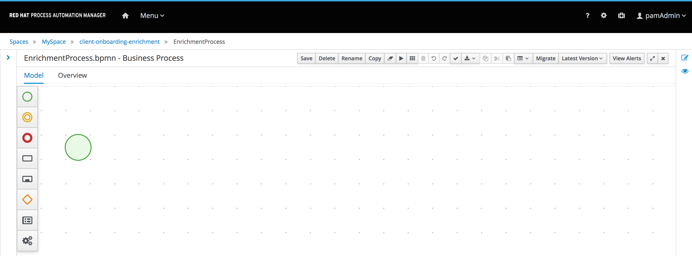

:scrollbar:

:toc2:
:linkattrs:

== Project Creation Lab

In this lab, you use Business Central to create a client onboarding data enrichment project. This project includes data objects, process definitions, decision tables, and forms.

Projects are used to group a set of business assets together. By using projects, you can organize the assets that affect organizational decisions.

.Goals
* Create a project
* Practice using data object models
* Create the initial process definition

.Prerequisite
* Successful lab environment setup

:numbered:

== Business Case

In this lab, you create a business process that gathers additional information from a client during the client onboarding process. The initial sign-up of the client is complete. During this _Enrichment_ phase, the client needs to provide the following additional information:

* The client's main address
* Various documents as required during the _Legal_ and _Know Your Customer (KYC)_ validations that follow
** Required documents depend on the type of client and are defined by business rules--in this case, a decision table

.Example Client Onboarding Process

In this lab, you implement the "Enrichment" phase shown here.

== Create Project
In this section you create the client onboarding enrichment project.

. Log in to Business Central.
. On the home page, click *Design*.
* This takes you to the *Projects* view. Note the context menu icon on the far right:
+

** You use this menu later in the course to import existing projects.

. In the *Projects* view, click *Add Project*:
+

. Complete the *Add Project* dialog using these values:
* *Name*: `client_onboarding_enrichment`
* *Description*: `Client Onboarding Enrichment`
+

+
[NOTE]
====
* Only the project name is required.
* It is a common practice to link the words that make up a project name with hyphens, as done in this case. This is preferred to using spaces, because using spaces results in file names with spaces in them.
* Be sure to select short project names--using one to four words.
* The *Show Advanced Options* link allows you to specify Maven component details that enable projects to link dependencies between each other.
====
. Click *Add*.
* Expect to see confirmation that the `client_onboarding_enrichment` project is successfully created.
* An empty *Assets* view is displayed for the project:
+

* Note the buttons in the middle of the page that allow you to add assets to the project, as well as the *importing items* link at the bottom of the page.

== Define the Enrichment Process

In this section, you define the first part of the client onboarding enrichment process.

=== Create Process Definition

The process definition in BPMN2 defines the structure and semantics of the process. In this first part of the lab, you simply create a process skeleton--the overall flow of the process. At later stages of this lab and in the next labs, you gradually implement various features of the process, including data models, decision tables, forms, and tasks.

. In the empty *Assets* view of the `client_onboarding_enrichment` project, click *Add Asset*.

. Select *Business Process*:
+

* Note that *Business Process* is one of 18 item types that allow a designer to easily create different business assets such as rules, processes, decisions, and test scenarios.

. On the *Create new Business Process* form, enter `EnrichmentProcess` in the *Business Process* field:
+

+
[NOTE]
====
For the business process name, use Pascal case--the practice of writing compound words or phrases in which the first letter of each concatenated word is capitalized. Following this convention is helpful when you are integrating the data objects with other IT components and reusing the data objects between other entities.
====

. Observe the contents of the *Package* field.
* Process Automation Manager assets are organized in packages. By default, the package is defined by the space name and the project.
+
[TIP]
====
You can also create your own package definitions. Packages help the engine to identify different assets that are named in the same way. For example, if you define a data object named `Request` in `project1` and another data object also named `Request` in `project2`, and then create dependencies between both projects, the package name where each `Request` data object definition is stored differentiates them. This is also the case with reserved item names--the package name of your data objects allows the engine to differentiate your data objects from built-in data objects with reserved names.
====
. Click *Ok*.
* The `EnrichmentProcess` business process opens in the Process Designer:
+

* You use the designer to create a BPMN2 enrichment process

==== Set Up Parallel Flow

This process consists of two parallel flows. One flow prompts the user to add additional details to their profile, and the other prompts the user to upload required documents.
To create a parallel flow within a BPMN2 process, you use a _parallel gateway_.

. The Object Library appears on the left side of the designer. Hover over the various icons to display each object's type.
. Click *Gateways* and drag the *Parallel* gateway onto the canvas to the right of the *Start Event* (green circle).
. Connect the *Start Event* and the *Parallel* gateway:
.. Click the *Start Event* to open the menu.
.. Click  (*Edge*) and drag it onto the *Parallel* gateway:
+

** This creates a connection between the two nodes:
+

==== Create User Task

In this section, you create the workflow for the "add additional details" user task. Instead of dragging BPMN2 constructs from the palette onto the canvas, you create these constructs directly from within the canvas.

. Click the *Parallel* gateway to open the menu.
. Click  (*Create Task*):
+

* This creates a task connected to the *Parallel* gateway:
+

. Click the task and hover over  (*Gears*) below the task to open the menu.
. Click  (*Convert into User*):
+

** This changes the node's task type to *User*.

==== Configure User Task

A _user task_ requires some properties to be set, such as the name of the task, the input and output data, and the actors or groups to which the task is to be assigned. In this lab, you configure only the name. You revisit the task properties in a later lab to provide additional configuration.

. Click the *User* task.
. Click  (*Diagram Properties*) on the right side of the designer.
. Add the following properties:
* *General*
** *Name*: `Add Client Details`
* *Implementation/Execution*
** *Task Name*: `add-client-details`
+

. Click *Save*.
+
NOTE: The *Name* field is mainly used for labeling purposes, while the *Task Name* field is the identifier of the task used by the runtime.

==== Prepare Layout for Second Flow

. Change the layout of the model by dragging the icons around to create a model as shown below:
+

*  This makes room for the second flow.

. Click *Save* to save the changes.
. In the dialog that opens, enter a description in the *Check in comment* field.
* Good practice is to state what kind of changes were made to the process and why. This allows for easier monitoring of changes by other team members in the future.

* Expect to see a *Warning* pop-up, stating that the validation of the process failed. The process, for example, does not have an end-state yet. You end these constructs in a later stage of the lab.

. Click *OK* to save the changes.
* Expect to see a notification that the process has been successfully saved.

==== Add Second Flow

In this section, you add the skeleton, or outline, of the second flow.

. Open the palette on the left-hand side of the editor, expand the *Activities* section, and drag a *Business Rule* task onto the canvas.
. Connect the *Parallel* gateway to the *Business Rule* task.
. Double-click the *Business Rule* task and enter `Determine Documents` in the *Name* field.
+
[TIP]
Double-clicking the node is an alternative to using the properties panel to set the name.
+

* Later, you revisit this node to configure the actual rules to be evaluated within the context of this node.

==== Create Subprocess

For this lab, you use the _business rule task_ to define which documents the user needs to upload. For each of the documents you need a subprocess. To accomplish this, you use a construct called a _multi-instance subprocess_, which allows you to create multiple instances of this process depending of the number of items in a collection (you configure that part later).

. Open the palette and expand the *SubProcesses* section.
. Drag the *Multiple Instance* subprocess onto the canvas.
. Connect it to the *Business Rule* task.
. Make the subprocess a bit larger than the standard size.
. Name it `Upload Documents`.
+

* In a later lab, you implement the process logic within the multi-instance subprocess.

==== Connect Parallel Flows
Next, you need to connect the two parallel flows and add an _end event_ to your process. You do this with a _converging parallel gateway_, which is the exact same construct as the parallel gateway you used earlier, except this time the gateway has two incoming connections instead of outgoing connections.

. Drag a *Parallel* gateway onto the canvas and place it after the `Add Client Details` task and the `Upload Documents` subprocess.
. Connect the `Add Client Details` task to the gateway.
. Connect the `Upload Documents` subprocess to the gateway.
. Finally, add an *End Event* to the process and connect it to the converging gateway:
+

+
. Save the process.

=== Validate Process Definition

The designer provides functionality to validate the model and determine whether there are any validation errors. This allows the user to discover problems early in the design process.

. Click  (*Validate*) at the top right.
* Expect to see a *Validation failed* warning:
+

. Click the `Determine Documents` task and open the *Properties* panel on the right side of the editor.
* As stated in the validation warning message, the problem is that you have not defined a `ruleflow-group` on the rule task. The `ruleflow-group` defines the collection of rules that need to be evaluated in the context of this rule node.
. In the property panel of the editor, expand the *Implementation/Execution* section and look for the *Rule Flow Group* field.
. Expand the *Rule Flow Group* field and select the `enrichment-required-documents` group.
+
TIP: If `enrichment-required-documents` does not appear in the list, click *New* and enter `enrichment-required-documents`.

* Later in the course, you add rules to your project (in the form of a decision table) and set the same group name.
. Save the process.

== Conclusion

In this lab you have completed the following tasks:

* Created your first Process Automation Manager project.
* Created a *Business Process* asset using the Process Designer.
* Created a skeleton/outline of the client onboarding enrichment process.

In the following labs you gradually enhance and improve this process until you have a fully executable process.
