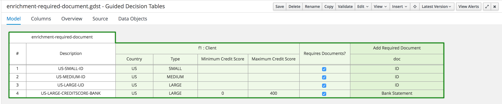
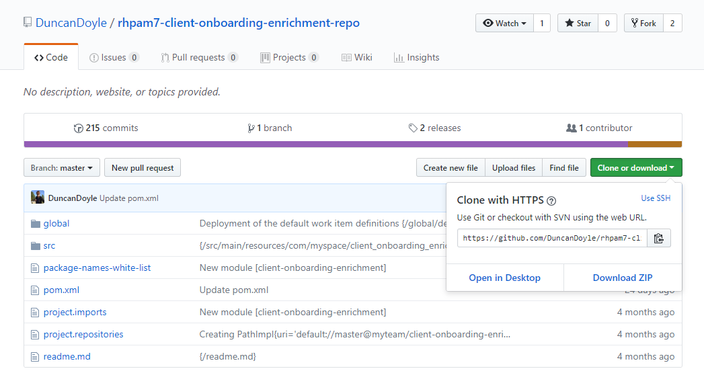
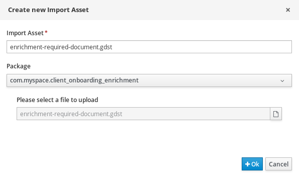
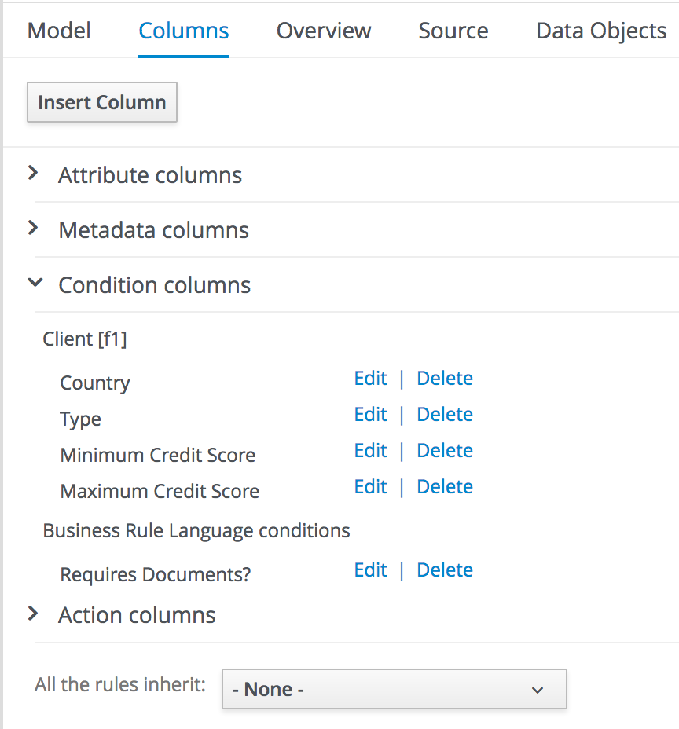
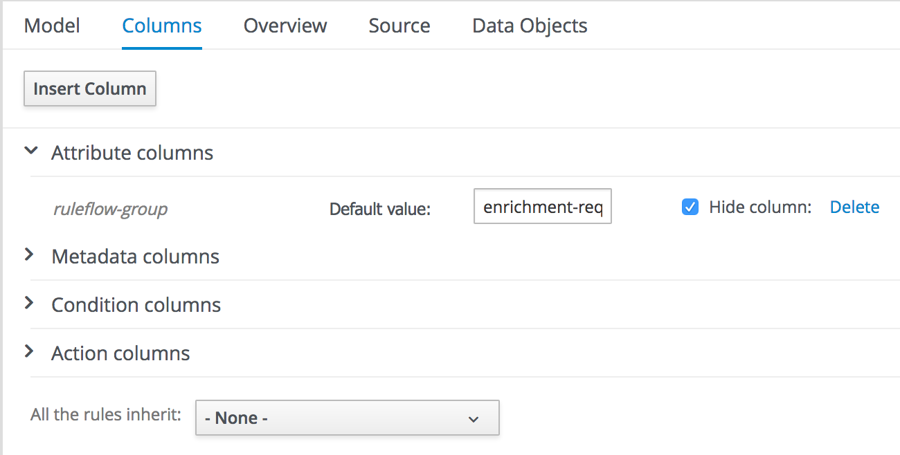
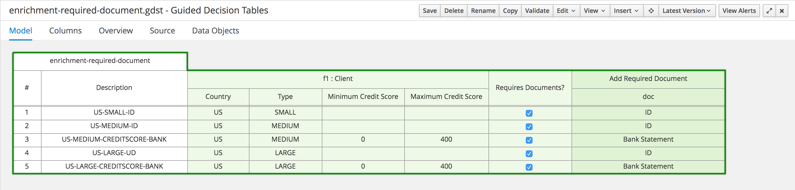

:scrollbar:

:toc2:
:gitHub_repo: link:https://github.com/DuncanDoyle/rhpam7-client-onboarding-enrichment-repo[GitHub repository]
:linkattrs:

== Import Assets Lab

In the previous lab, you created the initial process definition outline for your client onboarding enrichment process. In this lab, you create the decision logic to determine which documents the client needs to upload.

As you can see in the decision table, the rules define constraints on a `Client` data object. You create this part of the domain model in a later lab in which you explore the domain object editor.

.Goal
* Import decision table into an existing project

.Prerequisites
* Successful completion of the previous lab
* Successful Business Central login
* A `client-onboarding-enrichment` project

:numbered:

== Download Existing Assets

In this section, you download the GitHub repository to an accessible directory in the file system.

. Navigate to the {gitHub_repo}.
. From the *Clone or download* menu, click *Download ZIP*:
+

. Locate the downloaded ZIP file on your computer and unzip it to a directory in your file system.
* From this point forward, this location is referred to as `$PROJECT_HOME`.

== Import Decision Table

In this section, you import the `enrichment-required-document` decision table.

. In Business Central, open the `client-onboarding-enrichment` project.
. From the *Assets* view, click *Import Asset*.
. Enter `enrichment-required-document.gdst` in the *Import Asset* field.
. In the *Please select a file to upload* field, navigate to the `enrichment-required-document.gdst` file in the `$PROJECT_HOME/rhpam7-client-onboarding-enrichment-repo-master/src/main/resources/com/myspace/client-onboarding-enrichment` directory:
+

. Click *Ok*.
* When the file is done importing, expect to see the `enrichment-required-document` decision table.
. Examine the contents of the `enrichment-required-document` decision table, by selecting the *Columns* tab in the editor and expanding the *Condition columns* and *Action columns* sections.
. Click the *Edit* links to open the column definition wizard and explore the configuration options for the *Condition columns* and *Action columns*:
+

. Expand the *Attribute columns* section. Observe that the *ruleflow-group* attribute is already set to `enrichment-required-documents`:
+

* This matches the value of the *ruleflow-group* property in the *Business Rule* task you created in the previous lab. This means that the rules defined in this decision table are evaluated as part of the execution of the *Business Rule* task in your process.

. Click the *Model* tab and examine the rules in the decision table:
+

+
NOTE: The type of business, the country, and the credit score of a client determine which document the client needs to provide.
. Click  (*Close*) in the upper right to close the decision table editor.
