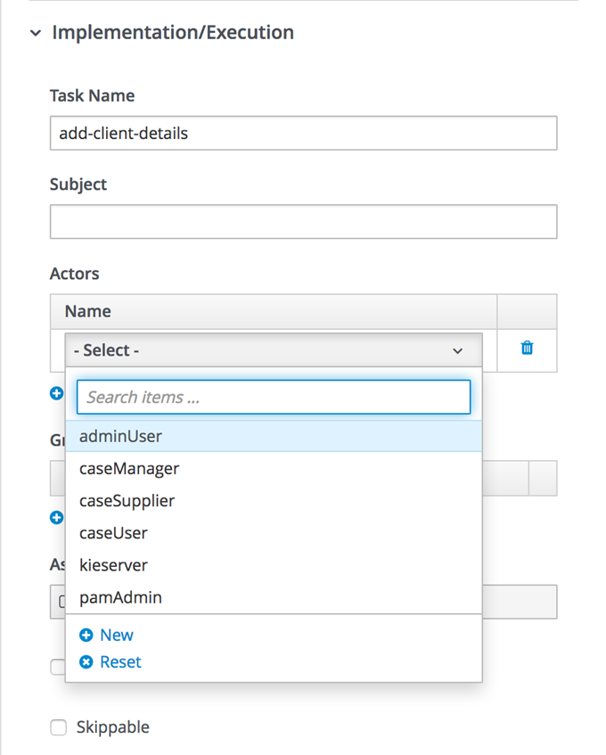

:scrollbar:

:toc2:

== Data Objects Modeling and Process Design Lab

In this lab, you create the _data objects_ (or domain model) to be used by your process. Each process uses, creates, and manipulates data. The data that the process stores within its process instance is defined by _process variables_. In Process Automation Manager, these process variables can be both primitive types (`int`, `double`, `boolean`) and Java classes (`String`, `Client`, `Document`). Because you are using a Java-based engine, you can either create new data objects for a project, or reuse existing data objects provided by other modules, libraries, or projects.

In this lab, you create the `Client` data object that is used in your process and decision table. You configure a process variable called `client` of this type. You also add additional process variables in which to store the names of the required documents (implemented as a `List`) and the actual uploaded documents.

.Goals
* Create a new data object
* Add a process variable of the new data type to the process
* Create process variables to capture the names of the documents to be uploaded and to hold the uploaded documents

.Prerequisites
* Successful completion of the previous lab in this course
* Successful Business Central login

:numbered:

== Create Client Data Object

In this section, you create the `Client` data object to be used in the process and rules.

. Open the `client-onboarding-enrichment` project.

. In the *Projects* view, click *Add Asset* and select *Data Object*.

. Complete the dialog as follows:
* *Data Object*: `Client`
* *Package*: Leave the contents as is
* *JPA*: Leave the box unchecked

. Click *Ok*.
+

. Define the fields (or attributes) of the `Client` data object using the data in the following table:
+
.`Client` Data Object Fields
[cols="3",options="header",caption=""]
|=======================================
|Identifier |Label |Type
|`id` |`ID` |*long*
|`name` |`Name` |*String*
|`type` |`Type` |*String*
|`bic` |`Business Identifier Code` |*String*
|`address` |`Address` |*String*
|`country` |`Country` |*String*
|`phoneNumber` |`Phone Number` |*String*
|`creditScore` |`Credit Score` |*int*
|=======================================
.. Click image:images/add-field-icon.png[] to begin.

.. When you complete the entries for a field, click *Create and Continue* to create it and open a new dialog to create the next field.

.. After completing the `creditScore` field, click *Create*.

. Confirm that your data object looks like this:
+
image::images/client-data-object.png[]

. Click *Save* to save your model.

== Create Process Variables

To use the `Client` data object in your process, you need to define a process variable of this specific type.

. Open the `EnrichmentProcess` business process, click the white area of the canvas to select the process, and open the *Properties* panel on the right side of the editor.

. Expand the *Process Data* section:

+

* This opens the *Process Variables* table.

. Click  and enter the following values:
* *Name*: `client`
* *Data Type*: `Client` (this is the type you created earlier)
. Click *Save*.

. Add a variable for the collection that holds the names of the documents the client is required to provide:

* *Name*: `requiredDocuments`
* *Data Type*: Custom: `java.util.List`
+
[NOTE]
====
The document names are set by the rules (decision table) you imported earlier. This same collection drives the multi-instance subprocess: for each entry in this collection (`List`), a subprocess instance is created.
====

. Define the following collection type:
* *Name*: `uploadedDocumentsCollection`
* *Data Type*: Custom: `java.util.List`
+
[NOTE]
====
This collection (`List`) stores the documents uploaded by the user as part of the process. It is called the *Multi Instance Collection Output*.
====

. Define the following variable to store a collection of documents:
* *Name*: `uploadedDocuments`
* *Data Type*: Custom: `org.jbpm.document.Documents`
+
[NOTE]
====
This is used to store the documents the user uploads via the Process Automation Manager's `DocumentStorageService` service to an Enterprise Content Management system. The `org.jbpm.document.Documents` data type is a predefined type that allows storage of a collection of documents using this service.
====
+

In the next section, you improve the process by implementing the multi-instance subprocess and configuring the business rule task and user task.

== Configure User Task
In this section, you configure the `Add Client Details` user task. Now that you have defined your process variables, you can create the input and output mapping of these process variables to task variables. In Process Automation Manager, process variables and task variables are decoupled, which means that if you want to work on a certain piece of data as part of a user task, you need to map a variable from the process instance to the task. If you want the changes made to this data as part of the task to be passed back to the process variable, you also need to define the output mapping from task variable to process variable.

. In the `EnrichmentProcess` process, click the `Add Client Details` user task and open the *Properties* panel.

. Expand the *Implementation/Execution* section.
. In the *Assignments* section, click image:images/edit-icon.png[] to open the *I/O Assignment* editor.

. Click  next to the *Data Inputs and Assignments* field and enter the following values:
* *Name*: `htClient`
+
[NOTE]
====
`ht` is simply a prefix that stands for human task--you can use any variable name you like.
====
* *Data Type*: `Client`
* *Source*: `client`

** This maps the `client` process instance variable to the `htClient` user task variable when this user task starts.

. Click  next to the *Data Outputs and Assignments* field and enter the following values:
* *Name*: `htClient`
+
[NOTE]
====
Note that this is the same name as the one used for the input variable. Because the forms in Process Automation Manager can only map a form field or subform to a single variable, you need to define an output variable that has the same name as the input variable if you want to use the same fields for displaying and updating client data.
====
* *Data Type*: `Client`
* *Source*: `client`

** This maps the changes made to the `htClient` user task variable back to the `client` process instance variable.
+

. Click *Save*.

. Assign the task to an actor and/or group:
* This defines which users can be the potential owner of this task and thus can work on it.

.. In the *Properties* panel of the `Add Client Details` user task, expand the *Implementation/Execution* section.

. In the *Actors* property, click *Add* and select `adminUser`.
* For the purposes of this lab, you set the value to your own username, `adminUser`.
+

. Save the process.

== Configure Business Rule Task

In this section, you configure the `Determine Documents` business rule task.

The rules in your `Determine Documents` business rule task need to evaluate data. As with the user task, you therefore need to define an I/O mapping of process variables to task variables. In the case of a business rule task, the variables defined in the input mapping are inserted in the KIE Session (or _working memory_) of the rules as so-called _facts_. This allows the rules to match to and evaluate the facts.

Variables defined in the output mapping are deleted from the KIE Session when the task has finished. This is important because multiple business rule tasks in the same process share a single KIE Session by default. Deleting facts after a business rule task has finished is therefore good practice because it prevents unwanted cross-talk between different rule tasks that can lead to unexpected results of rule evaluations.

For this lab, you want the rules to work on `client` and on `requiredDocuments`, as the rules evaluate `client` (and its fields) and add one or more entries to the `requiredDocuments` collection as a result of the rule evaluation.

. In the `EnrichmentProcess` process, click the `Determine Documents` business rule task and open the *Properties* panel.
. Add the following input mapping for `client`:
* *Name*: `client`
** This is the same name as the one used for the input variable.
* *Data Type*: `Client`
* *Source*: `client`
. Add the following input mapping for `requiredDocuments`:
* *Name*: `requiredDocuments`
** This is the same name as the one used for the input variable.
* *Data Type*: `java.util.List`
* *Source*: `requiredDocuments`
. Define the same output mappings so that the facts are deleted from the session when the business rule task completes.
. Make sure your final mapping looks similar to this:
+

. Click *Save*.

=== Instantiate Process Variable

For this business rule task to function correctly, you need to add one other configuration. You insert the `requiredDocuments` variable into the rules session. However, this variable has not been initialized at this stage of the process and therefore is `null`. As a result, the rules in your decision table do not match and fire. To solve this issue, you need to initialize this process variable before the rules are evaluated. There are multiple ways to do this. In this lab, you use an _On Entry Actions_ script on the business rule task to instantiate the process variable.

. Open the `EnrichmentProcess` process, click the `Determine Documents` task, and open the *Properties* panel.
. Look for the *On Entry Actions* property in the *Implementation/Execution* section and add the following expression:
+
....
kcontext.setVariable("requiredDocuments",new java.util.ArrayList());
....
. Click *OK* and save the process.

== Configure Multi-Instance Subprocess

In this section, you configure the `Upload Documents` multi-instance subprocess. As stated previously, you want an instance of this subprocess to be created for every required document defined in the `requiredDocuments` collection. Also, each uploaded document needs to be added to `uploadedDocumentsCollection` when the subprocess instances finish.

=== Define Variables

First, you define the process variables of your subprocess. You need a variable that holds the name of the document that needs to be uploaded in the specific subprocess instance. You also need a variable that can hold the uploaded document.

. In the `EnrichmentProcess` process, click the `Upload Documents` multi-instance subprocess and open the *Properties* panel.
. Expand the *Process Data* section to access the *Process Variables* list.
. Add a variable to keep track of whether the document has been approved:
* *Name*: `approved`
* *Data Type*: `boolean`
+

. Add a variable that defines the document type to be uploaded:
* *Name*: `requiredDocument`
* *Data Type*: `String`
. Add a variable that holds the uploaded document:
* *Name*: `uploadedDocument`
* *Data Type*: `org.jbpm.document.Document`

=== Configure Properties

Next, you configure the multi-instance properties.

. In the *Properties* panel of the `Upload Documents` multi-instance subprocess, expand the *Implementation/Execution* section.
. Set the following properties:
* *MI Collection input*: `requiredDocuments`
** This is the input collection. For each entry in this collection, a subprocess is created.
* *MI Collection output*: `uploadedDocuments`
** This is the output collection. Each subprocess instance stores, upon completion, the variable defined in *MI Data Output* in this collection.
* *MI Data Input*: `requiredDocument`
** This is the name of the variable that maps to the entry in the input collection for which this subprocess is created.
* *MI Data Output*: `uploadedDocument`
** This is the variable that is collected on completion of the subprocess and that is stored in *MI Collection output*.
+

== Implement Multi-Instance Subprocess

In this section, you implement the actual process logic of the `Upload Documents` multi-instance subprocess. The logic of the subprocess is as follows:

* The client gets a task to upload the requested document.
* An employee of the financial service provider gets a task to verify the uploaded document.
** If the document is approved, the subprocess finishes.
** If the document is not approved, the user task for the client is reactivated/recreated.

=== Create User Task for Client

First, you create the client's user task.

. Create a *Start Event* in the subprocess.
. Create a *User Task* node connected to the *Start Event*:
* *Name*: `Upload Document - #{requiredDocument}`
* *Task Name*: `upload-document`
+
[NOTE]
====
The `#{requiredDocument}` syntax in the name is replaced at runtime with the value of the `requiredDocument` process variable. This allows it to show different task names, depending on the document the user is required to upload.
====
. Set `adminUser` as the task's *Actors*.
+
[NOTE]
====
In an enterprise implementation this would be the user ID of the client in the Process Automation Manager system to whom the task needs to be assigned.
====
. Add the following input mapping:
* *Name*: `htRequiredDocument`
* *Data Type*: `String`
* *Source*: `requiredDocument`
+
[NOTE]
====
Because this does not need to change in the user task, you do not need to define an output mapping for this variable.
====

. Add the following output mapping:
* *Name*: `htUploadedDocument`
* *Data Type*: `org.jbpm.document.Document`
* *Source*: `uploadedDocument`
** This is the document the user uploads to the system.
. Save the process
+

+

=== Create Document Approval User Task

The reason for the `Document Approval` user task is that the document uploaded by the user needs to be approved and accepted by an internal employee before the process can continue.

. Create a new *User Task* node connected to the `Upload Document` user task:
* *Name*: `Approve Document - #{requiredDocument}`
* *Task Name*: `approve-document`
+
[NOTE]
====
Again, the `#{requiredDocument}` placeholder is replaced at runtime with the value of the `reuqiredDocument` process variable.
====
. Set `adminUser` as the task's *Actors*.
+
[NOTE]
====
In an enterprise implementation the task would be assigned to the group of employees qualified to approve these uploaded documents.
====
. Add the following input mapping:
* *Name*: `htClient`
* *Data Type*: `Client`
* *Source*: `client`
+
[NOTE]
====
Because this does not need to change in the user task, you do not need to define an output mapping for this variable.
====
. Add the following input mapping:
* *Name*: `htRequiredDocument`
* *Data Type*: `String`
* *Source*: `requiredDocument`
+
[NOTE]
====
Because this does not need to change in the user task, you do not need to define an output mapping for this variable.
====
. Add the following input mapping:
* *Name*: `htUploadedDocument`
* *Data Type*: `org.jbpm.document.Document`
* *Source*: `uploadedDocument`
+
[NOTE]
====
Because the document does not need to change, you do not need to define an output mapping for this variable.
====

. Add the following output mapping:
* *Name*: `htApproved`
* *Data Type*: `Boolean`
* *Source*: `approved`
+

+

=== Create Approval Decision Gateway and Flows

In this section, you design the decision point based on the approval or rejection of the uploaded document. You use the *Data-based Exclusive (XOR)* gateway for this. This gateway allows you to define, based on process variables or facts in the session, which path in the process to take.

==== Define Approved Flow

. Enhance your subprocess model as shown below, using the *Data-based Exclusive (XOR)* gateway and an *End Event*:
+

. Create the conditional logic on the sequence flows going out of the *XOR* gateway:
.. Click the arrow that connects to the *End Event* node.
** This is the route the process uses when the document is approved.
.. Open the *Properties* panel and expand the *Implementation/Execution* section to expose the *Condition Expression* field.
.. Add the following condition:
+
....
return approved;
....

==== Define Rejected Flow
You now have the option to either set the decision logic on the sequence flow going back to the *Upload Document* user task, or to define a *Default Gate* on the *XOR* gateway. For this lab, you use the latter to learn this specific construct.

. Click the *XOR* gateway on the right with the two outgoing flows and open the *Properties* panel. Expand the *Implementation/Execution* section.
. In the *Default Route* list, select *Exclusive* to define the sequence flow that points back to the user task as the default gate to be used.

. Save the process.

. To be sure everything is fine, click image:images/validate_button.png[] (*Validate*).

== Conclusion

This completes the process definition for the client onboarding enrichment process. In the next lab, you create the forms for your process and take the process for a test run.
