:scrollbar:

:toc2:

== Forms Lab

In this lab, you create the forms for the user tasks that you defined in your process, as well as the form to start the process.

The Process Designer in Process Automation Manager provides an easy way to create form definitions--it can automatically generate the start-form and the forms for all of the user tasks defined in your process. The forms can, of course, also be manually created by clicking the *Add Asset* button and choosing the *Form* asset type.

In this lab, you use the easier option and have Process Automation Manager generate the forms for you.

:numbered:
== Generate Forms

. Open the `EnrichmentProcess` process.
. At the top of the editor, click 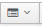 and select *Generate all Forms*:
+
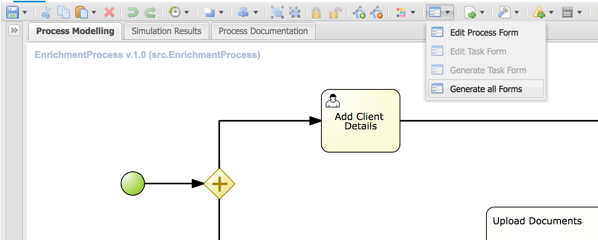

* Expect to see a green notification stating that the process and task forms were generated.
. Go back to *Assets* view, click the filter list, and select *Form*.
+
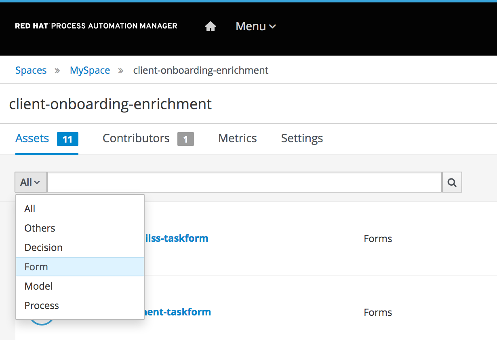
* Expect to see five forms.

== Explore Forms

The five forms that were generated include one process start form, which is used, as the name implies, to pass data to the process when a new process instance is started. There are three task forms--one for each user task in the process. The fifth form is a data object form for the `Client` data object, which is needed because the new Form Modeler provides only form field bindings for primitive types, Strings, and numbers (Integer, Double, etc.).

When a *Model Field* is a complex object, like `Client`, the Form Modeler binds that field to a subform--a form for that specific data type. You can have more than one data object or data type form. For example, it might be that in one user task form you want to display only a subset of the fields of a `Client`, and in another user task form you want to display all of the fields. In that case, you can create two data object forms for the `Client` type--one for each user task.

In this section, you examine the `src.EnrichmentProcess-taskform` process start form.

. Open the `src.EnrichmentProcess-taskform`.
* Expect to see a simple, generated form that allows you to enter the `Client` fields:
+
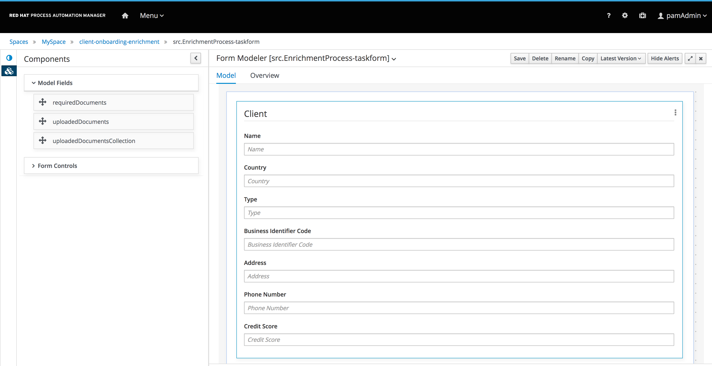

. Click the *Model Fields* category in the *Components* list.
* This shows all of the process variables (or in the case of tasks, task variables) that can be added to the form.
. Click the *Form Controls* category.
* This shows a rich set of out-of-the-box form controls that can be used in the Form Modeler using a WYSIWYG editing style.

== Modify Forms

In this section, you improve the start form a bit. There are two things that you want to change in this form. First, you want to limit the fields that can be filled in for a client to four fields: `name`, `country`, `type`, and `creditscore`. Then you want to add some HTML form controls to improve the look and feel of the form--for example, add a title and an image.

=== Limit Values of Client Subform

. Click image:images/kebab_white_icon.png[] on the right in the *Client* section of the form and select *Edit*.
* This opens the *Field properties* dialog for the `client` process variable.
. Observe that the *Field Type* is set to *SubForm*, and the *Nested Form* is the `Client` form.
+
[NOTE]
====
At this point, you have two options--either change the `Client` form and remove the unwanted fields, or create a new form for the `Client` data object. Because the `Client` form is used in other user task forms as well, you need to create a new data object form for `Client`.
====
. Go back to the project's *Assets* view via the bread-crumb navigation and click *Add Asset*.
. Filter on *Form* and select *Form*.
. Enter `EnrichmentProcess-Client-dataobjectform` for the *Name*, leave *Package* as is, and select *Data Object*.
. In the *Select Data Object from project* list, select `com.myspace.client_onboarding_enrichment.Client` and click *Ok*.
+
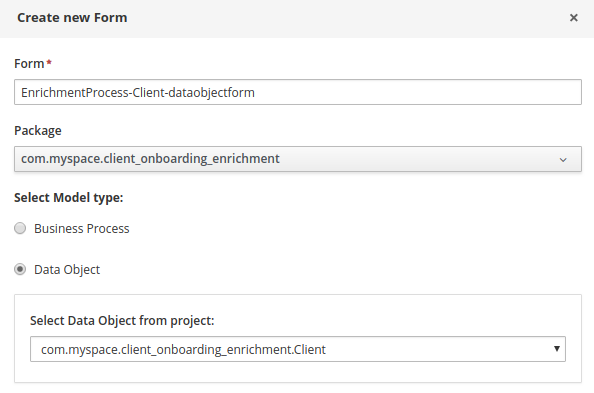

. In the *Components* list, click the *Model Fields* category.
* This lists all of the `Client` data object fields.
. Drag the `name` field onto the canvas.
* This opens the *Field properties* dialog.
. Examine the options that it provides and click *Ok* to use the default configuration.
. In the same way, add the other three fields: `country`, `type`, and `creditScore`:
.. Keep the default properties or optionally add a *Help Message* or change the *PlaceHolder*.
+
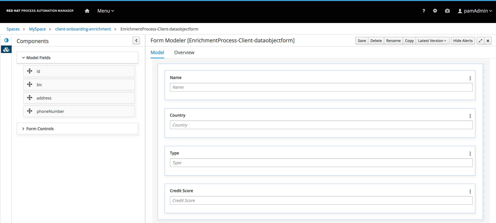

. Save the form.
. Go back to the `src.EnrichmentProcess-taskform` start process form and click image:images/kebab_white_icon.png[] next to `Client`.
* This opens the *Field properties* for the `Client` field of this form.
. In the *Nested Form* list, select the form you just created: `EnrichmentProcess-Client-dataobjectform` and click *Ok*.
* Expect the form layout to change and show only the four required input fields.
. Save the form.

=== Add HTML Components

Next, you add some additional HTML components to improve the look and feel of your form.

. In the *Components* list, click the *Form Controls* category.
. Drag *HTML* to the top of the form.
* The *Edit HTML Component* dialog opens.
. Click 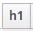 and enter `Add a New Client`.
* The "h1" formatting increases the font, centers the text, and makes it bold.
. Add a second HTML component just under the first one:
.. Click 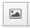 and enter `http://static.opendigitalautomation.com/fortress_bank_and_loan-logo.png` in the *Image* field.
. Below the image, enter `Fortress: Bank & Loan` and click *Ok* to close the editor.
* Expect the form to look something like this:
+
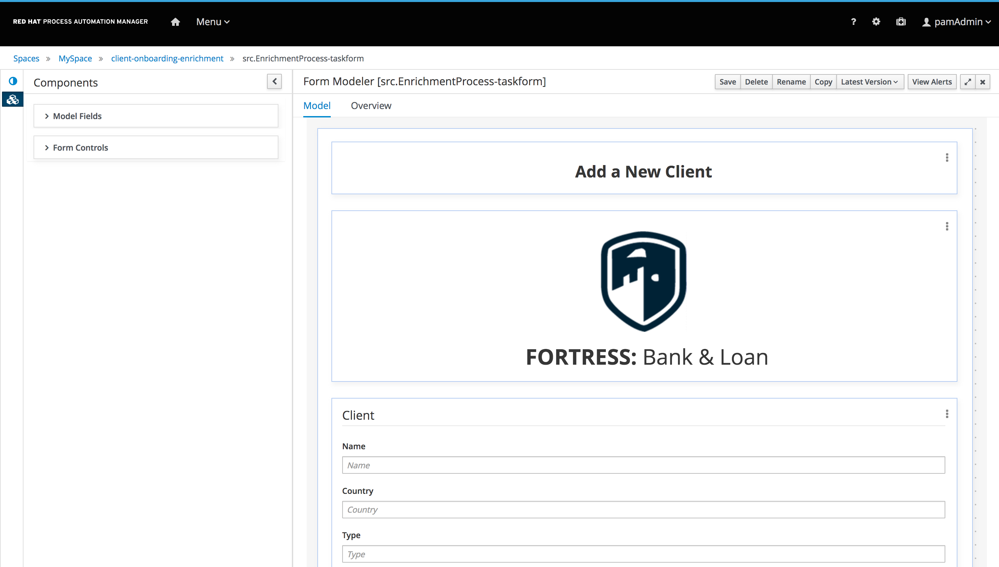

For the purposes of this lab, you use the auto-generated forms for the remaining user tasks. Of course, if you want to, you can edit and change them using the same procedures you used on the start process form.

== Run Process

With the entire project complete--from data objects to rules, processes, and forms--it is now time to deploy your project on the Process Server (which is also called the Execution Server or KIE Server).

Process Automation Manager uses Maven for project builds. The project assets are packaged in a component called a KJAR or "Knowledge JAR." The KJAR file is a Java JAR file with a specific deployment-descriptor, `kmodule.xml`, which you can find in the JAR files' `META-INF` directory.

When Business Central finishes building the KJAR, it deploys it to the internal Maven Repository in Business Central. This repository can be accessed by going to the *Administration* page.

. Click  in the upper right corner of Business Central:
+
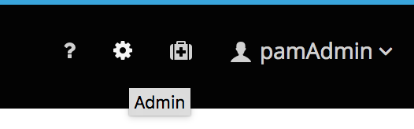

. On the *Settings* screen, select *Artifacts*.
* This opens the internal Maven *M2 Repository Content* page. Each time you successfully build a project in Business Central, the artifact is stored in this repository.

. Go back to the *Assets* view of your `client-onboarding-enrichment` project.
. Click the *Settings* tab:
+
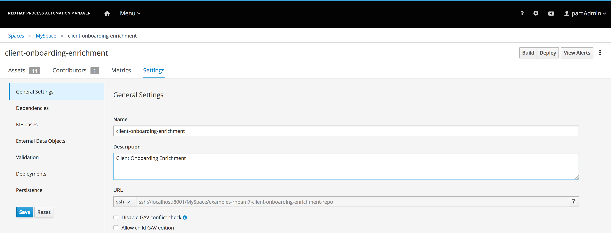
* The *Settings* view allows you to change many aspects of your project, including the project's name, GAV (GroupId, ArtifactId, and Version, which make up the unique identifier of the project's KJAR), and deployment configurations (Runtime Strategy, Marshallers, etc.).

=== Build and Deploy Project

In this section, you build and deploy the project onto the Process Server (KIE Server) runtime.

. Click the *Assets* tab in the upper left corner of the editor to go back to the *Assets* view.
. Click *Deploy* in the upper right.
* This initializes a build, creates a KJAR, pushes the KJAR into the Business Central Maven repository, and deploys the KJAR onto the Process Server (KIE Server).
+
[NOTE]
====
If a message appears indicating that you have conflicting repositories, simply click *Override*.
====
* Expect a message to appear stating that the build and deployment are successful.
. Click *Menu -> Deploy -> Execution Servers*.
* Expect to see your Execution Server, `client-onboarding-enrichment_1.0.0`, in the *Deployment Units* section, and a green checkmark in the box in the *Status* section.
** This indicates that the KIE Container is running on your Process Server (KIE Server).

=== Test Process
Now that you have deployed the process on the Execution Server, you can start an instance of your process and test the flow.

. Navigate to *Menu -> Manage -> Process Definitions*.
* The *Process Definitions* page lists all of the processes that have been deployed on the execution servers connected to Business Central. In this case, expect to see the `EnrichmentProcess` in your `client-onboarding-enrichment_1.0.0` KJAR:
+
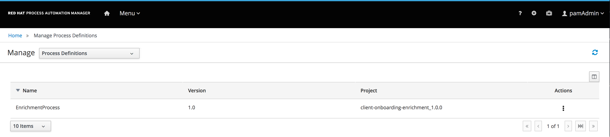

. Click 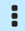 to the right of the process definition and select *Start*:
+
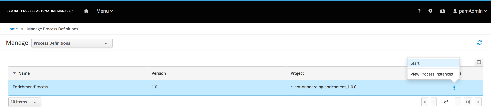

. Enter the following details for the client you want to sign up:
* *Name*: `Acme Corp`
* *Country*: `US`
* *Type*: `MEDIUM`
* *Credit Score*: `350`

. Click *Submit*.
. Once the process has started, navigate to *Menu -> Manage -> Process Instances*.
* Expect the table to show a single entry--the `EnrichmentProcess` instance you just started:
+
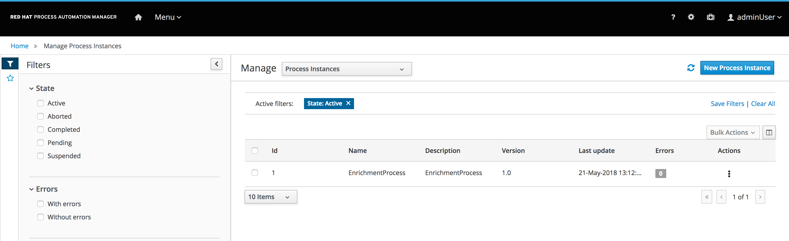

. Click the process instance to open the *Instance Details* view and navigate through the various tabs on this screen to explore the available functionality:
* View the current values of the process variables.
* Edit process variables.
* View the BPMN2 diagram that shows the current state of the process instance.
* Inspect the business and technical logs of the process instance.
. Inspect the process diagram.
* The process is waiting on a number of tasks that need to be completed, including the `Add Client Details` task.
. Navigate to the *Task Inbox* page by clicking *Menu -> Track -> Task Inbox* and review the following tasks:
* `Add Client Details`: The task to add additional clients.
* `Upload Document - ID`: An `Upload Document` task for an ID document.
* `Upload Document - Bank Statement`: The same `Upload Document` task, but this time for a bank statement.
+
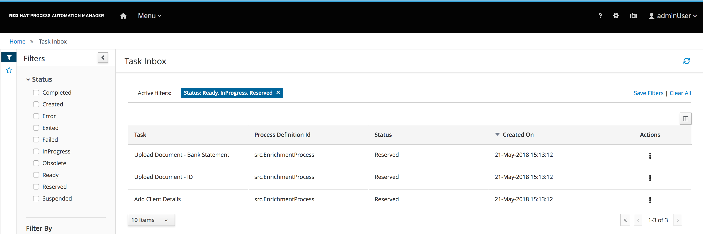

. Click the `Add Client Details` task to open the task form and observe that this page was generated by the Form Modeler.
. Click *Start* at the bottom of the page to start working on the task.
. Add any values you like for the following fields:
* *Business Identifier Code*
* *Phone Number*
* *Address*
. Click *Complete* to complete the task.
. Go back to the *Instance Details* view of this process instance and open the process diagram:
+
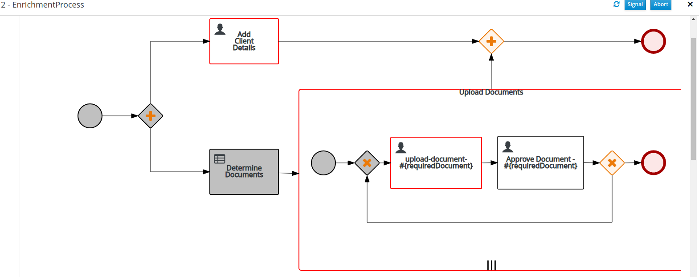
* Expect to see that the `Add Client Details` task was completed.
