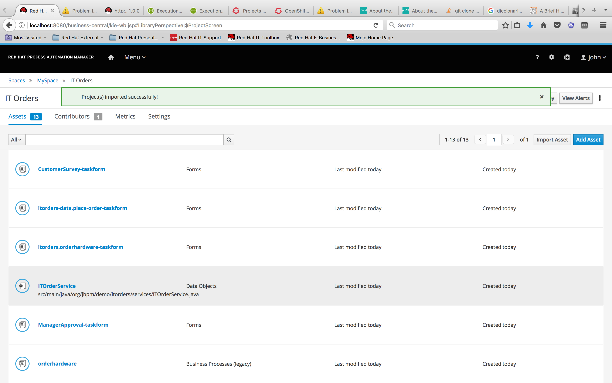
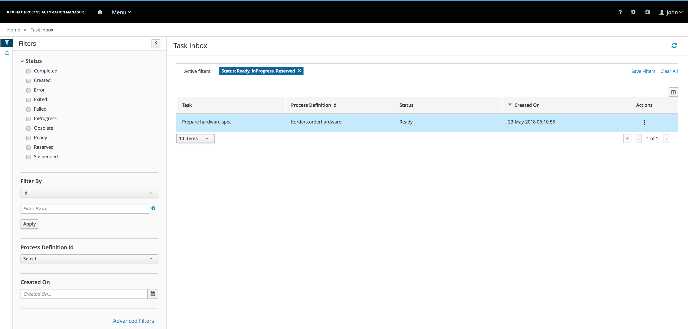

:scrollbar:

:toc2:

== Sample Case Project Navigation Lab

This lab showcases the new Case Management features supported in Red Hat Process Automation Manager 7. It uses the  Business Central environment that you provisioned during the environment setup lab in the first module. The business assets are retrieved from the `IT Orders` sample project, one of the demonstration samples available.

In this lab, you import the `IT Orders` project into the Business Central workbench and navigate through the project's assets, such as case definitions, rules, case properties, and forms. You build and deploy the project onto the Process Server, the platform's lightweight runtime engine, after which you start an `IT Orders` process instance. Finally, you explore the runtime process and task management using the process instance to highlight the differences in the execution of a case.

.Goals
* Become familiar with case management business assets and their organization for a case project
* Search for and open business assets for viewing and understanding the differences between a case and a project at the configuration level
* Become familiar with the build and deployment process of a case
* Start a process instance and explore the REST API to interact with it

.Prerequisites
* Successful completion of the environment setup lab for this course
* Successful login to Business Central

:numbered:

== Create Sample Case Project

For this exercise, you use a sample to create a new case management project.

. Go to the *Projects* view in Business Central:
+

. From the *Projects* view, click image:images/kebab_white_icon.png[] and select *Try Samples*.

. On the Try Samples page, select the IT_Orders case management project and click Ok:
+

. Inspect the assets in the project:
+

* The *Assets* view shows a tabular list of the assets in the project.

== Navigate Case Management Project

. Select the `orderhardware` business process and inspect the properties.

* The `AdHoc`, `Case ID prefix`, and `Case Roles` properties are unique to a case management project:
+

. Examine the `Place order` subprocess node:
.. Select the node and examine the properties in the *Properties* panel.
+
****
*Question*:

Which variables are passed from the main process?
****

.. Examine the variables that are `CaseFile` variables.

. Click the subprocess node to open the `place-order.bpmn` process definition:
+

. Select the `Place order` user node and view the node's properties.

. Expand the *Implementation/Execution* section of the properties.

. Click the  under *Assignments* and examine the variables defined for this user node, observing the differences between the variables `_hwSpec` and `requestor`:
+

== Build and Deploy Case Project

. Navigate to the project's *Assets* view and click *Deploy* to build and deploy the project.
+

* Expect to see a message pop up with the status of the deployment:
+

. Navigate to *Manage -> Process Definitions*.

. Find your process definition:
+

. Select the `Order for IT hardware` process definition and review the details of the process:
+

== Execute IT Orders Case Project

. Use the REST endpoints in the API to interact with your case process instance.
.. Navigate to the API Swagger page and locate the *Case instances :: Case Management* section:
+

.. Locate the endpoint that starts a case instance and click *Try it out*:
+

.. Enter the required information about your container ID and the process definition ID:
+
image::images/api-definition-parameters.png[]
** Note that you can also pass variables to the case using JSON syntax.

.. Execute the call and expect to see a response similar to this:
+

.. Execute the call again but, this time pass the required parameters to the process, including role assignments for the case:
+
[IMPORTANT]
====
Change the parameter values to match your username and the roles you created.
====
+
----
{"case-data" : {  },
  "case-user-assignments" : {
    "owner" : "adminUser",
    "manager" : "adminUser"
  },
  "case-group-assignments" : {
    "supplier" : "admin"
 }
}
----

** Expect to see a response similar to the following, containing your case instance ID:
+

== Review Process Instance

In this section, you review the process instance running in Business Central.

. Navigate to *Manage -> Process Instances*.
. Select the process instance that you just started and review the process instance details:
+

. Navigate the different information sections and review the instance variables, logs, diagram, etc.:
+

+
****
*Questions*:

* Which nodes have been started?
* Can you identify the milestones of the process?
****

. Go to the *Task Inbox* and review the tasks that are available to you from your process instance:
+

. Create an empty file named `test.txt`.
. Select the `Prepare hardware spec` task and complete it by uploading the `test.txt` file you just created:
+

. Review the newly created user task to approve a new hardware request, and complete that task as well:
+

. Every time you complete a newly created user task, go back to your process instance and review the status of the process:
+

. Once you have completed all of the tasks, review the current active nodes:
+

. Go to the case documents and verify that the document that you uploaded is there.

+

== Signaling Milestones

. Check the completion conditions for the process milestones and review how the signaling works for those milestones.
+
[NOTE]
====
In a real-life scenario, this would be done by the client application via the API.
====
+

. In the *Milestone 2: Order shipped Data I/O* dialog, under *Data Inputs and Assignments*, observe that a condition is required for `org.kie.api.runtime.process.CaseData(data.get("shipped") == true)` to tag the milestone as complete and continue the work. 

. To pass the milestone, locate the `POST` endpoint in the kie-server Swagger: `/server/containers/{id}/cases/instances/{caseId}/caseFile/{dataId}` and set the `shipped` value to `true`:

+

. After executing the `POST` method for `Milestone 2: Order shipped`, confirm the case instance state, and observe that it is now in `Milestone 3: Delivered to customer`.

+

. Use the existing `POST caseFile/data` endpoint to tag the required variable for `Milestone 3: Delivered`:

+

. Confirm the `Customer satisfaction survey` status in the process instance diagram

+

== Complete the Case

. Navigate to the *Task Inbox*, start and complete the `Customer satisfaction survey` task.

. Confirm the `Diagram Completed` state in the process instance diagram:

+

+
[NOTE]
====
Although you can see that all enabled tasks in the case are complete, the process *Instance State* remains `Active`.

====

. Locate the `POST` endpoint in the kie-server Swagger for closing case instances, and provide the case details along with a close comment.

+

. After executing the close comment, confirm the *Completed* status of the process instance using Business Central:

+

