:scrollbar:

:toc2:

== Entando Process Driven Application Lab

The goal of this lab is to walk through building POC applications that front business automation components.

.Goals
* Integrate Entando App Builder with Red Hat Process Automation Manager
* Add process kickoff forms to an application
* Use custom widgets to build pages

.Prerequisites
* Completion of the lab in module 4

.System Requirements
* Java Development Kit (JDK) 1.8+
* Maven
* Git

:numbered:

== Deploy Entando App Builder from Source

. From the command line, change to the folder where you want the source code to be located--for example `~/git`:
+
----
cd ~/git
----

. Clone the Git repository:
+
----
git clone https://github.com/entando/examples.git
----

. Move to the following example application directory, then build and run the application using Maven:
+
----
cd examples/entando-5.0/mortgage/mortgage-demo-applicant/entando-applicant
mvn -Djetty.port=8180 clean jetty:run
----
+
[NOTE]
Adjust the port for the application server as needed, setting it to avoid conflict with other services.

* Expect to see lines similar to this in the log when the server has started:
+
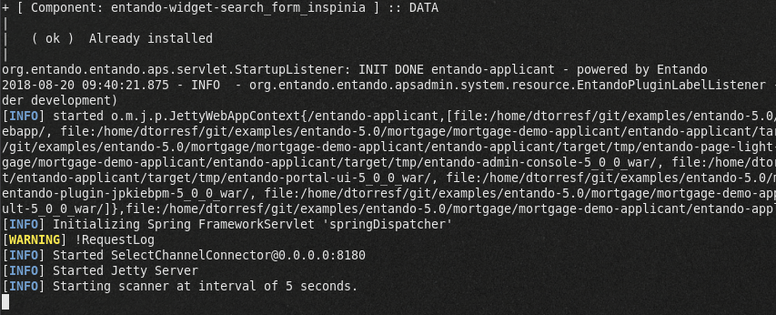

. Navigate to the Entando Platform home page at `http://localhost:8180/entando-applicant/`:
+
[NOTE]
====
Adjust the port in the URL if needed.
====
+
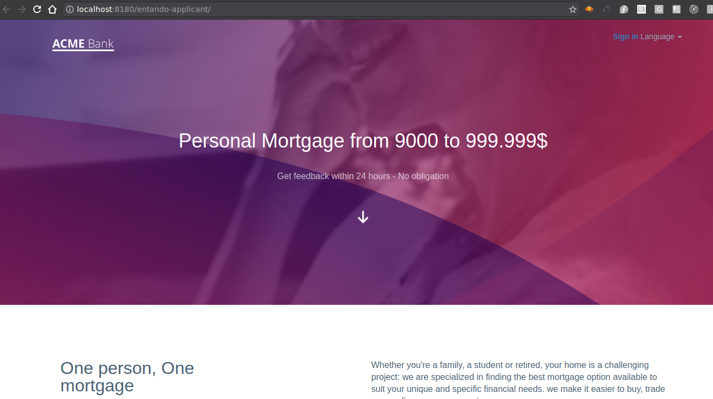

. Log in to the Entando Platform by navigating to `http://localhost:8180/entando-applicant/do/login` and entering the following credentials:
* *Username*: admin
* *Password*: adminadmin
+
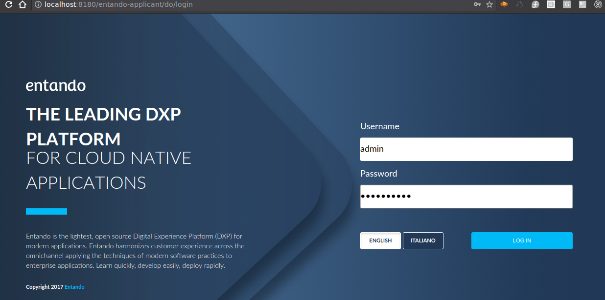

== Install KIE Project

In this section, you deploy the mortgage project from the Git repository.

. In Business Central, select *Import Project*.
. Enter `https://github.com/gpe-mw-training/rhpam-mortgage-demo.git` in the *Repository URL* field:
+
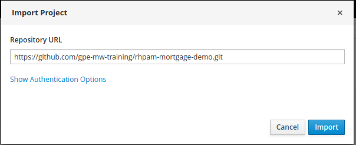

. Click *Import*.
. Select `PAM-Mortgage-Demo` from the *Try Samples* page and click *Ok*.

+
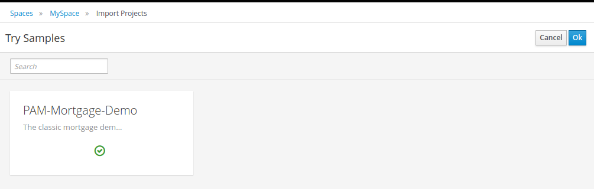

. Wait for the assets to populate in the *Assets* view.

. Once you see that the 27 assets are done loading, click *Deploy*:
+
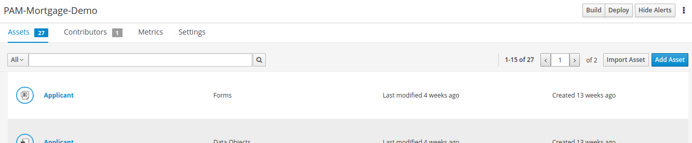

. Wait for the build and deploy success messages.
. Navigate to *Menu -> Deploy -> Execution Servers* to verify that the `mortgage_1.0` deployment unit has been added:
+
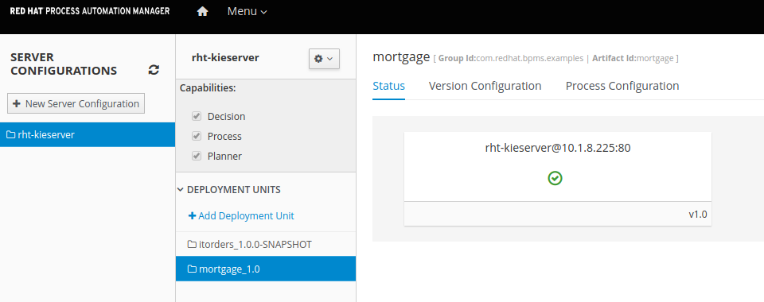

+
[NOTE]
====
Your screen may not display the same deployment units as shown. Just confirm that the `mortgage_1.0` deployment unit is present in your list.
====

== Configure Process Automation Manager in Entando

In the previous module, you worked with the IT Orders sample. The Entando PAM plug-in can connect to one or more process servers, which can be either version 6 or version 7. In this section, you connect Entando App Builder to the RHPAM server where you installed the IT Orders project.

. From the Entando Admin Console, navigate to *Integrations -> Components -> Red Hat PAM Config*:
+
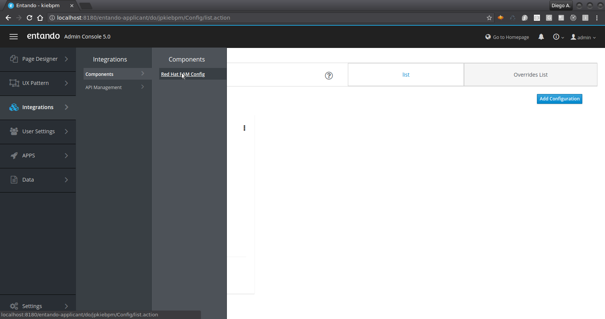
. Click *Add Configuration*.
. Provide the following details for connecting to a remote KIE Server:
+
[NOTE]
====
You use the same KIE Server as in the previous labs. Refer to the lab in module 1 for more details about the server you are connecting to.
====
* *Active*: `ON`
* *Name*: `remote-ocp`
* *Host name*: Use the external traffic route for the `rht-kieserver` pod in your OpenShift environment.
+
[NOTE]
====
* In this example, the route in OpenShift is `http://rht-kie-server-bxms-pam-datf.apps.952e.openshift.opentlc.com`.
* Note also that you need to remove the HTTP protocol, and use just `rht-kie-server-bxms-pam-datf.apps.952e.openshift.opentlc.com`.

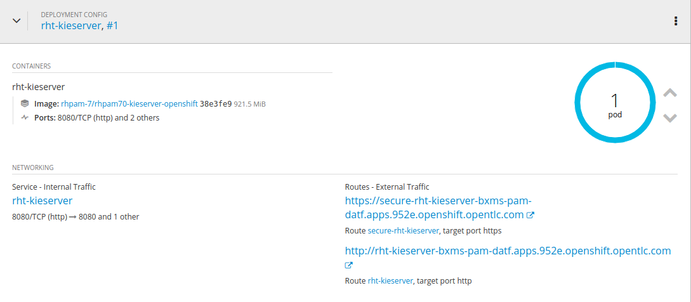
====
* *Schema*: `http`
+
[NOTE]
====
If you use the secure route you need to use `https`, although the secure route may cause certificate issues because it is not configured for production traffic. For this lab, use `http`.
====

* *Port*: `80`
* *WebApp Name*: Leave blank
* *User name*: `adminUser`
* *Password*: `test1234!`
* *Conn. Timeout (in millis)*: Leave blank
+
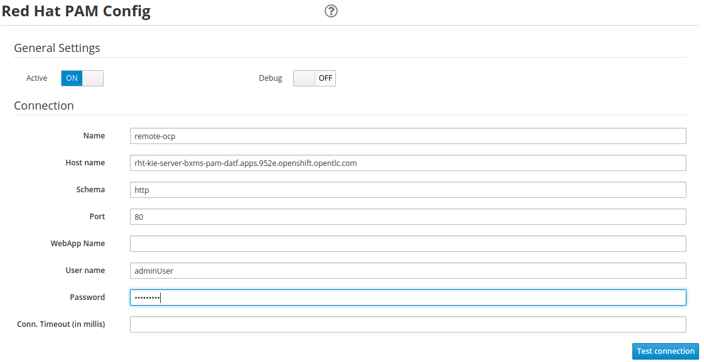

. Click *Test connection* and watch for the *Success* message:
+
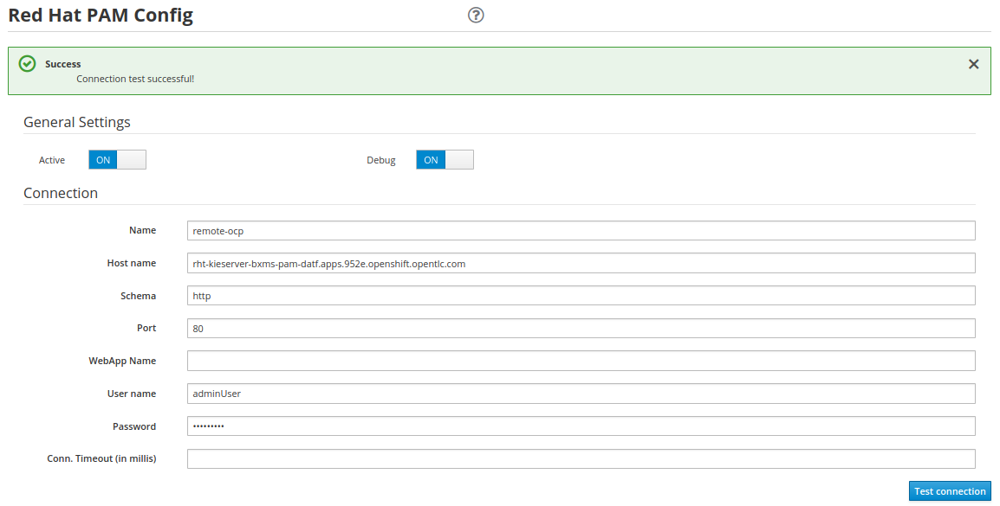
+
[TIP]
====
To troubleshoot the connection, toggle *Debug* to `ON` at the top of the page, and then check the terminal window you opened in the first section of the lab.

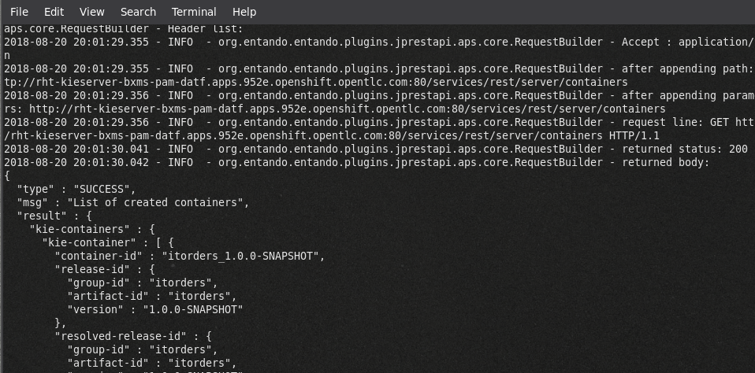
====

== Review Entando Components

The demo application is prebuilt for the most part. You tear it down and rebuild it during the next section, but first you take a tour of the main components.

=== Explore Page Models

A page model describes the starting place for creating a page in Entando App Builder, defining both the design-time layout and the base HTML that comprises the page when seen in the runtime application.

. Navigate to *UX Patterns -> Page Models* to create or update the page models available in your Entando application:
+
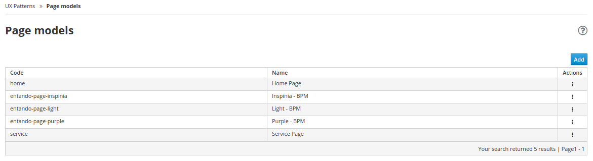

. Observe that each page model requires the following values:

* *Code*: A unique identifier consisting of lowercase letters and without blank spaces.
* *Name*: The display name for choosing the model during page creation.
* *XML Configuration*: This defines the grid layout for the page.
* *Template*: This defines the core HTML of the page. Note that this is a FreeMarker template that has some custom tags to connect to the widgets from the XML configuration.

=== Explore Pages

Pages are what you build in an Entando Application, and they are listed in *Page Designer -> Page Tree*.

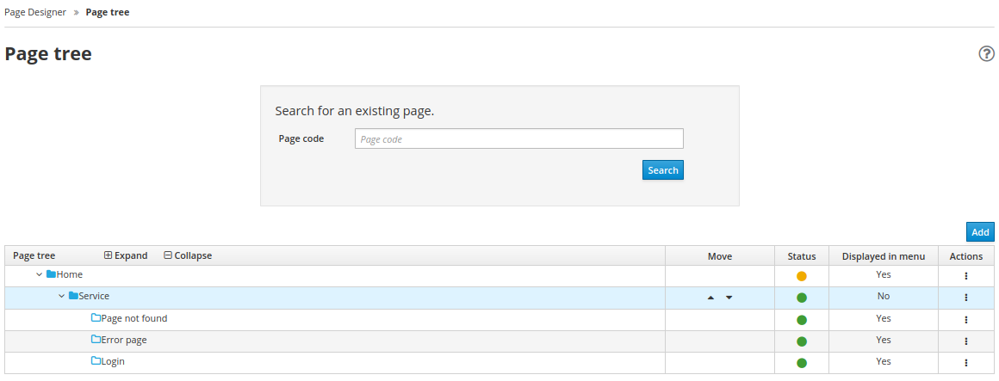

. Click  to the right of a page in the *Page Tree* to see the management options:

* *Add*: Creates a new page that is a child of the selected page
* *Edit*: Updates the properties of the page (access, page model, page title, etc.)
* *Configure*: Opens a page designer for drag-and-drop content editing
* *Details*: Shows the direct link to the page and lists the shared UI components used in the page
* *Clone*: Makes a copy of the page
* *Unpublish*: Removes the page from the live site, but leaves it available for editing

=== Explore Widgets

There are three main types of widgets in Entando:

* Core widgets
** These are available in all Entando applications
** Examples include login forms and system notifications

* Plug-in widgets
** These are provided via specific plug-ins
** Examples include the RHPAM process and case management widgets

* Ad hoc widgets
** These are widgets created in the App Builder Admin Console
** Use them to create quick reusable chunks of content that can be dragged and dropped onto a page

=== Explore User and Access Management

==== Explore Roles

You use roles to limit the access to a particular page or component of Entando. The system comes with an `Administrator` role built in, and it is this role that grants access to the App Builder Admin Console.

You can create additional roles to secure your pages via *User Settings -> Roles*:

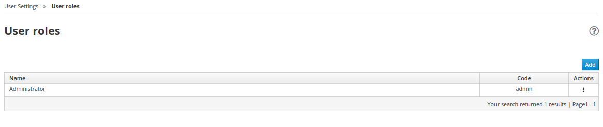

==== Explore Users

You manage users via *User Settings -> Users*. The main actions consist of the following:

* *Edit*: Change the password, enable or disable
* *Manage authorizations*: Manage the groups and roles that the user belongs to

==== Explore Groups

Groups enable you to control privileges and settings for a collection of users and to provide access to a protected resource. The groups do not have specific meaning for Entando App Builder itself, but may be used for custom plug-in functionality.

[NOTE]
The RHPAM widgets use groups to map to roles in the Process Server. This allows the Entando pages to "filter" assets, such as the task data table, by a particular role defined in the RHPAM Process Definition. Prepend `bpm_` to the group code for this to be picked up by the plug-in.

=== Explore Internationalization (I18N)

Entando provides robust support for i18n in App Builder. Out of the box, Entando is configured for English and Italian. You can manage languages via the *Settings -> Labels and Languages* page:

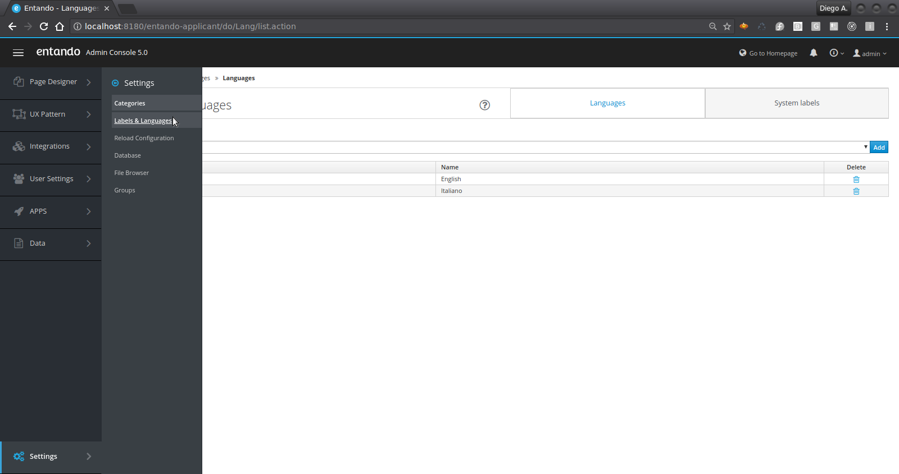

Click *System labels* in the upper right corner to view or edit the labels. A placeholder is available for each language enabled in the Entando application instance.

== Rebuild Mortgage Demo Application

In this section, you rebuild the `PAM-Mortgage-Demo` application.

=== Reset Home Page

. Navigate to *Page Designer -> Page Tree*.
. Click image:images/kebab_icon.png[] in the `Home` row and select *Edit*:
+
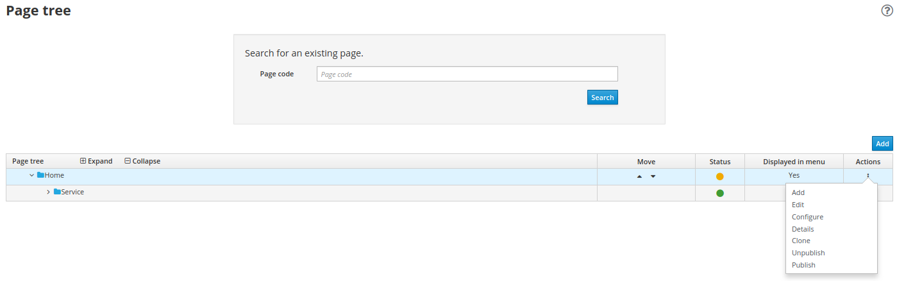

. Change *Page Model* to *Home Page*:
+
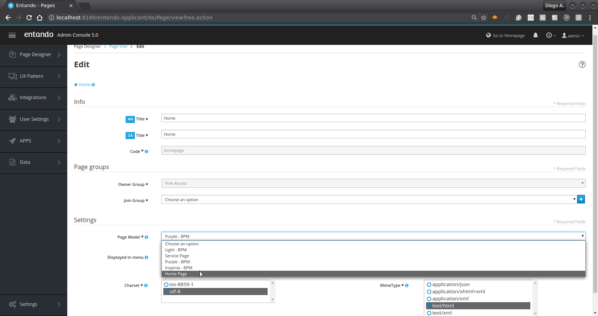

. Click *Save and Configure*, then click *Publish*.
* You can ignore the warning about rendering the template:
+
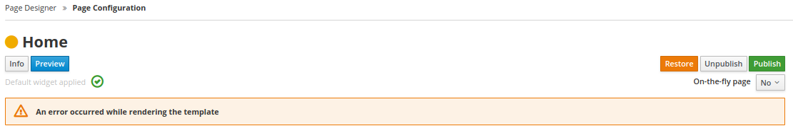

. Verify the change by clicking *Go to Homepage* in the upper right:
+
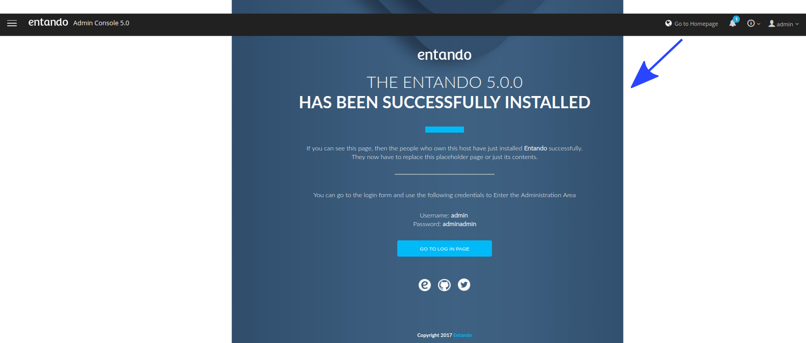

=== Recreate Application Page

. Navigate to *Page Designer -> Page Tree*.
. Click image:images/kebab_icon.png[] in the `Home` row and select *Edit*:
+

. Change *Page Model* back to *Purple - BPM*.
. Click *Save and Configure*.
. From the right-hand panel, drag and drop custom widgets onto the page using the placement information in this table:
+
[cols="2",options="header"]
|=======================================
|Widget Name |Frame on Page
|`Choose a Language` |*Top Bar 4*
|`entando-widget-banner_main_page_light` |*Central Bar 1*
|`entando-widget-left_columns_mortgage` |*Central Bar left*
|`entando-widget-right_col_help_purple` |*Central Bar right*
|`entando-widget-banner-advisors` |*Banner Advisor*
|=======================================
+
[TIP]
====
* Click *Preview* at any point to see the unpublished changes.
* Select *Change preview mode* at the bottom of the preview page to adjust screen sizes:
+
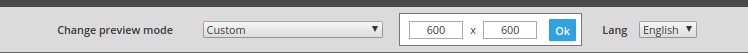
====

+
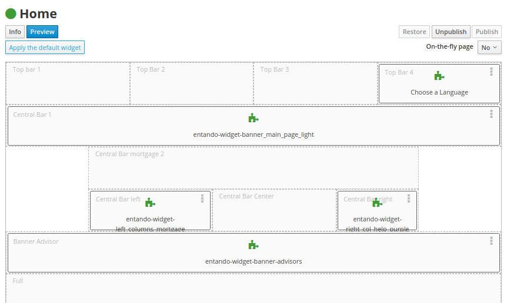

. Click *Publish* to make the page live in the application.
. Verify the change by clicking *Go to Homepage* in the upper right.

== Verify Process Automation Manager Configuration

In this section, you make sure that the application is configured to connect to an RHPAM Process Server that contains the Mortgages KIE deployment.

=== Add Process Form

. In Entando App Builder, navigate to *Page Designer -> Page Tree*.
. Click image:images/kebab_icon.png[] in the `Home` row and select *Edit*.
. Click *Save and Configure*:
+

. Drag and drop the `BPM-Form by DataType` widget onto the *Central Bar Center* frame.
* Expect a configuration page to appear.
. Select `MortgageApplication @ mortgage_1.0` from the *Process* list and click *Choose BPM process*:
+
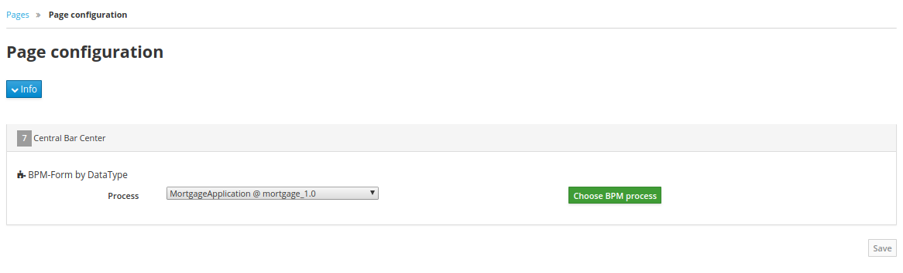
+
[NOTE]
The *Process* list is retrieved from the configured Process Server at *Integrations -> Components -> PAM Config*. Entando App Builder queries the Process Server for its deployment units and the processes hosted in each deployment unit.

. Click *Save*.
. Click *Publish*:
+
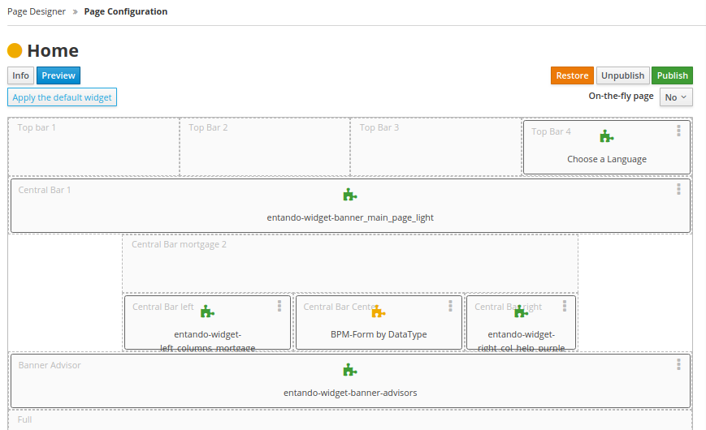

. Verify the change by clicking *Go to Homepage* in the upper right:
+
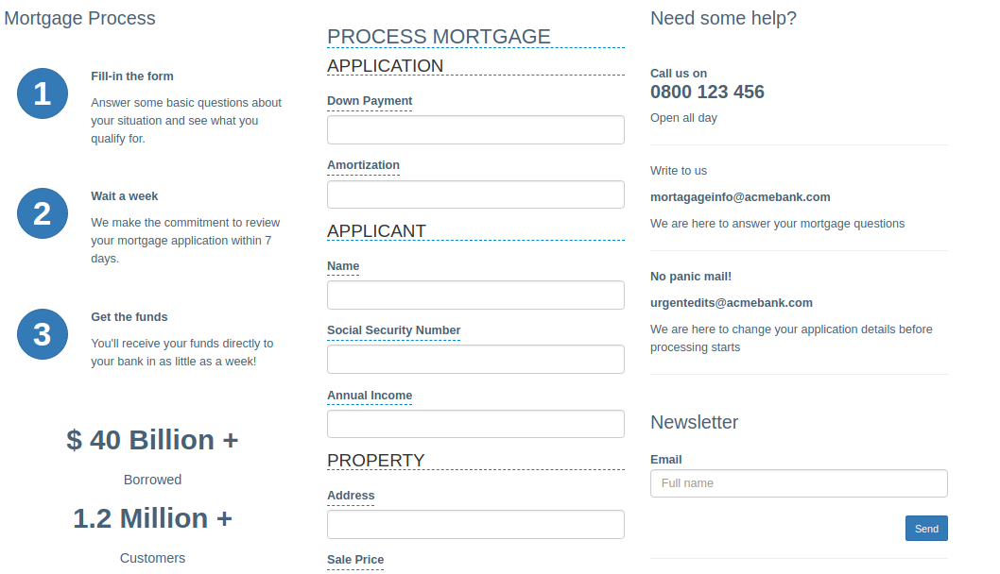
