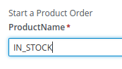

:scrollbar:
:data-uri:
:toc2:
:order_fulfillment: link:https://github.com/gpe-mw-training/rhpam-order-fulfillment[Order Fulfillment]
:ocp_web_console: link:https://docs.openshift.com/container-platform/3.9/architecture/infrastructure_components/web_console.html#project-overviews[ocp web console]
:ocp_cli_logs: link:https://docs.openshift.com/enterprise/3.0/cli_reference/basic_cli_operations.html#troubleshooting-and-debugging-cli-operations[ocp cli logs]
:jbpm_executor: link: http://docs.jboss.org/jbpm/release/7.0.0.Final/jbpm-docs/html_single/#_jbpm_executor[jbpm executor]
:stockwih: link:https://github.com/gpe-mw-training/rhpam-order-fulfillment/blob/master/src/main/java/org/acme/order_fulfillment/StockReviewMockWih.java[StockReviewMockWih source code in gitHub]
:magic_error_handling: link: http://mswiderski.blogspot.com/2017/06/execution-error-how-to-deal-with.html[Maciej's blog for Execution error - how to deal with unexpected in jBPM 7.1]
:stockwih_1: link:https://github.com/gpe-mw-training/rhpam-order-fulfillment/blob/master/src/main/java/org/acme/order_fulfillment/StockReviewMockWih.java[StockReviewMockWih]

== Out of the Box Monitoring

In this lab, you will navigate the existing projects to observe the available out of the box monitoring and dashboards.

.Goals
* Filter Process Instances
* Filter Tasks
* Observe changes in the Process and Task monitoring

:numbered:

== Prepare a project to monitor
In this section we will prepare a project that can be easily monitored. A project to showcase the managing and monitoring capabilities will use the following characteristics:

* Process Definition annotated with SLA.
* The Process has Human tasks
* Causes an exception that can be fixed.

image:images/order-fulfillment-process.png[]

We will import the {order_fulfillment} project with this purpose.

. Import the {order_fulfillment} project to Business Central
. After the `indexing` has been announced to be completed by Business Central, deploy the `Order Fulfillment` project.

+
image:images/indexing-completed.png[]

+
[NOTE]
====
You can toggle the visualization of alerts at the bottom of the assets list by clicking the `view/hide` alerts button from the project menu in the top right corner

image:images/alerts-button.png[]

In the `Alerts` section you can wait for the message: `Completed indexing of MySpace/examples-rhpam-order-fulfillment`

You can also re-size the `Alerts` section by dragging the top margin up and down
====

. Confirm that the `order-fulfillment` deployment unit is running in the runtime server

+
image:images/order-fulfillment-deployment.png[]

+
[NOTE]
====
Please don't mind that I have only 1 deployment unit in my screenshot, you might have more deployment units based in the previous exercises
====

+
[NOTE]
====
You might have noticed already that the process of `deploy` takes some seconds to be performed, sometimes it could take a couple minutes, depending on the weight of the kjar to be implemented in the kie-server and network latency, it is not `milliseconds immediate deployment`, please be patient. You could also monitor the kie-server logs using the {ocp_web_console} or the {ocp_cli_logs} if it makes you feel better ;)
====

== Process Instance Monitoring

We have previously used the `Manage` option to start and analyze process instances. In this section we will observe changes in the monitors based in the actions performed with process instances.

=== The shortest path

Open the `order_fulfillment` process from the `order-fulfillment` project, and notice the path followed when there is stock to fulfill the product order:

image:images/in_stock_process.png[]

====
Here, when the Gateway checking `article available` evaluates to `Yes`, the flow is sent to the `Package and Ship` Human Task, once the human task is completed, the process instance is complete.
====

In order to create a process instance that will follow that path by default, we will request a process instance with the product name: **IN_STOCK**.



In order to request a process instance with this product name follow these steps:

. From the **Manage** menu, select the **Process Definitions** option

+
image:images/menu.png[]

. From the **Process Definitions** locate the **order_fulfillment**, and from the kebab menu to the right of the record, select **start**

+
image:images/start-process-instance.png[]

. In the **ProductName**, enter **IN_STOCK**
. Press the **Submit** button

Now we navigate to observe the state of the **Process Instance** monitors:

. From the **Track** menu, select the **Process Reports** option
. Observe the **Active Processes**, you should be able to see 1 for order_fulfillment reflected in the charts.

+
image:images/order_fulfillment_monitor_1.png[]

+
[NOTE]
====
This dashboard could be combined with the results of the previous lab executions, showing more color, the important thing to note is the addition of order_fulfillment to the mix. If you hover over the **Processes By Type** pie, you will be able to see the Number 1 for order_fulfillment active process.
====

. Select the **Tasks** option from the **Manage** menu
. Locate and click the **Package and Ship** task in **Ready** status.

+
image:images/package-and-ship-1.png[]

. Claim, start and complete the task using any `Shipping Address` and `Tracking Number` values

. Monitor the Process Reports and notice the `Completed Process`
. Monitor the `Task Reports` and notice 1 task completed for the process `order_fulfillment`

+
image:images/order_fulfillment_monitor_2.png[]

=== The red path

We have also prepared the process characteristics to cause an error that can be fixed. When you enter **ERROR** in the product name, the first node: `Stock Review` fails and we will need to troubleshoot and fix the process instance.

. Start a process instance with **ProductName** `ERROR`:

+
image:images/error-request.png[]

. Go to the Process Reports Monitor and confirm 1 additional Active Process for `order_fulfillment` (You have completed 1, and we have 1 active)

+
image:images/order_fulfillment_monitor_3.png[]

. Select **Process Instances** from the **Manage** menu, and observe that the `Active` **order_fulfillment** process instance has **4 Errors**.

+
image:images/errors-process-instance.png[]

+
[NOTE]
====
**Why 4 Errors if the `Stock Review` activity only throws 1?**

* The `Stock Review` activity throws 1 error each time is executed with the **ERROR** product name.

**This means that `Stock Review` has been executed 4 times?**

* Yes, `Stock Review` has been configured as an `Asynchronous Task`, this means that a component in the engine called the {jbpm_executor}, will retry the activity by a default number of 3 times (you can configure the number of retries and the frequency of those in the server properties)

====

. Click the **4** Errors cell in the `order_fulfillment` process instance row. By this, note that the filter configuration and the **Manage** drop-down selection has changed to show the 4 execution errors for your process instance.

+
image:images/errors-process-instance-2.png[]

. Click one of the rows and analyze the Details given by Business Central. Note that the error root cause is:

+
```
Caused by: java.lang.RuntimeException: Error while stock review
	at org.acme.order_fulfillment.StockReviewMockWih.executeWorkItem(StockReviewMockWih.java:48)
```

+
[NOTE]
====
Confirm and observe the functionality by looking at the {stockwih}, read the line 48 as the error detail says, note that it throws an exception if the product name is "ERROR":

[source,java]
----
if ("ERROR".equalsIgnoreCase(po.getProductName()))
  throw new RuntimeException("Error while stock review");
----
====

. Close the error details from the top right corner **X**, this will return to the error list for the process instance.
. From the kebab menu of one of the rows, select the **Acknowledge** option

+
image:images/acknowledge-error.png[]

. From the kebab menu of one of the remaining rows, select the **View process** option. Note that the number of errors for the process instance has decreased.

+
[NOTE]
====
By definition every error that is caught and stored is unacknowledged, that means it is to be handled by someone/something (in case of automatic error recovery). That is the base approach to allow to filter on existing errors if they have been already taken care of or not. Acknowledgment on each error saves user who did the acknowledgment and the time stamp for traceability purpose. Thus the number of errors for the process instance here, means `The number of errors that has not been acknowledged`
====

. From the kebab menu of the process instance, select the **Abort** option and confirm the abort action.

. In the Process Reports, Confirm the Aborted process monitor.

+
image:images/order_fulfillment_monitor_4.png[]

. Go to the **Manage > Execution Errors**, and note that 3 errors still not acknowledged: Acknowledge the 3 errors.

+
[NOTE]
====
Even if the process instance is in a complete stage (In our case it has been `aborted`), the execution errors still need to be reviewed, troubleshooted, handled and acknowledged. There are means for automating the acknowledge of high volume of errors, check {magic_error_handling}
====

=== Fixing the red path

. Create another `ERROR` process instance.
. From the kebab menu in the `Error` process instance row, select **View jobs**. Note that the filter has changed to show the jobs for the process instance.

+
image:images/kebab-error-process-instance.png[]

. The process instance has 1 job, lets see the job status by clicking the `Columns Button` ( image:images/columns-button.png[] ) at the top right corner of the jobs list.

. From the available columns, make sure the `Status` column is selected.

+
image:images/status-column.png[]

. Note that the Job Status is **Error**, from the Actions kebab menu in the job row, select the **View process**

+
[NOTE]
====
**More about the `Executor`**

The `Executor` component creates jobs to retry the operation when an error is found during or after an asynchronous task. The job  happy path of statuses will be: **Queued -> Running -> Completed**, other statuses that can be assigned to a job are **Canceled, Completed and Error**.
Our **Error** job can be `requeued`, but first we will fix the issue that is causing the failure: The **ProductName**.
====

. Acknowledge the 4 Errors from the process instance.

. Requeue the job and notice that a new error is logged in the process instance, because we have not fixed yet the data.

. Acknowledge the new error.

. Go back to the **Manage > Process Instances** and click in the `order_fulfillment` process instance row.

. Select the **Process Variables** tab.

+
image:images/process-variables-tab-error.png[]

. From the **productName** row in the **Process Variables** tab, select the **Edit** action button.

. Change the **ERROR** value for **IN_STOCK** and click **Save**

+
image:images/in_stock-process-var.png[]

. Go back to the **Manage > Process Instances** and select the **View jobs** action from the `order_fulfillment` process instance row. Note that the **Error** status remains in the job.

. Requeue the job, and notice that after the action, its status changes to **Completed**.

. Select the **View process** action from the job, and from the process instance, select the **Diagram** tab. Note that now the process instance is waiting for the `Package and Ship` human task.

+
image:images/package-and-ship-pending-process.png[]

. Locate the `Package and Ship` task, claim, start and complete the task.

. Compare the monitors to have a new `Completed` task and a new `Completed` process instance for the `order_fulfillment` process.

=== Volume loading

In this section we will use a `curl` command operation to send multiple process instance requests and monitor the execution of the process instances and tasks.

The {stockwih_1} is configured to randomly select a product name from a dictionary that is already available in the kie-sever instance in Openshift. The random operation will also create `ERROR` elements in its options, causing the behavior described in previous sections.

To individually test the creation of a `RANDOM` product name:

. Start a process instance for `order_fulfillment` with the `RANDOM` value in the **ProductName** field.

+
image:images/random-request.png[]

. Review the started process instance log and diagram to resolve any errors and human tasks created by the `random` operation.

. Repeat a couple times this process to get familiarized with different random results:

[cols="3",options="header"]
|=======================================
|Node|Random Value|Process Flow Description
|*Stock Review*| `IN_STOCK` or `RANDOM` product name with in-stock flag to `true` | Activates only the `Package and ship` human task. Go and claim, start and complete the human task to complete the process instance.
|*Stock Review*| `ERROR` product name or `RANDOM` error product name | Logs the error to the Manage Execution Errors. Go and `acknowledge` the errors, when retrying a `RANDOM` the second try might retrieve an actual product name instead of repeating the `ERROR`, thus fixing the job execution. If the `RANDOM` generates `ERROR` 3 times, then a job will be created, retrying the job with `RANDOM` might release the process instance for the next step.
|*Stock Review*| `RANDOM` product name with in-stock flag to `false` | Starts a **Procurement** sub-process
|*Supplier Stock Review*| `RANDOM` days to deliver (less than 2 days) | Executes the `Order From Supplier` REST Web service simulation, and starts a `Inventory supplier reception` human task. Go and claim, start and complete the human task, this will create a new `Package and Ship` human task that you also need to claim, start and complete in order to complete the process instance.
|*Supplier Stock Review*| `RANDOM` days to deliver (more than 2 days) | Signals the `Inform Customer` task for email simulation, then, executes the `Order From Supplier` REST Web service simulation, and starts a `Inventory supplier reception` human task. Go and claim, start and complete the human task, this will create a new `Package and Ship` human task that you also need to claim, start and complete in order to complete the process instance.
|*Supplier Stock Review*| `RANDOM` undeliverable flag | Cancels the sub-process execution and handles the **Undeliverable** business exception with an email and web service simulation. No further actions to perform.
|=======================================

We will use a `curl` unix command to load multiple `RANDOM` process instances through the REST API over HTTP for the KIE-SERVER.

[source,ruby,linenums]
----
for i in {1..100}; do \
echo "-"; \
curl -X POST "http://localhost:8080/services/rest/server/containers/order-fulfillment/processes/org.acme.order_fulfillment.order_fulfillment/instances" -H "accept: application/json" -H "content-type: application/json" --user adminUser:test1234! -d "{\"productName\":\"RANDOM\"}"; \
done
----

* `for i in {1..100}; do` This line starts the for loop that will repeat the command a 100 times; if you want to start 50 instances instead, here is where you make the proper change to the command

* `echo "-";` this line just creates separation in the console output.

* `curl -X POST ...` this line contains the url, authentication, process definition and data for the `curl` command that interacts with the KIE-SERVER. The http address here will vary depending on where you are executing the command from.

* `done` this line closes the loop for the execution


To execute the **Start Process Instance `curl` command** and load 100 process instances:

. Login to the Openshift Container Platform.

. From the Overview, expand the `kieserver` deployment config

+
image:images/ocp-expand-ks.png[]

. Click the blue circle (Kie server pod)

. Select the **Terminal** tab

+
image:images/ocp-ks-terminal-1.png[]

. Use the following command for 100 instances in the terminal:

+
[source,ruby,linenums]
----
for i in {1..100}; do \
echo "-"; \
curl -X POST "http://localhost:8080/services/rest/server/containers/order-fulfillment/processes/org.acme.order_fulfillment.order_fulfillment/instances" -H "accept: application/json" -H "content-type: application/json" --user adminUser:test1234! -d "{\"productName\":\"RANDOM\"}"; \
done
----

+
image:images/ocp-ks-terminal-2.png[]

. The terminal will log the process instance id as it goes starting them

+
[NOTE]
====
You can use your local machine to execute this command, but instead of http://localhost:8080 you will use one of the external traffic routes for the kie-server described in the build config:
image:images/ocp-expand-ks.png[]

For this you will need an OSx terminal that knows what `curl` means.
If you use the secure route (https), please remember to add `--insecure` to the curl command.
====

. Go to Business Central **Process Reports** and see 100+ total processes

+
image:images/hundred-process-instances.png[]

. From the **Process Reports** page, select the **View table** link in the top right corner.

+
image:images/original-table-processes.png[]

. Sort the table by `Duration` by clicking in the column header.

=== Volume complete
Remember that in order to complete these process instances you will need to complete the create human tasks.
We will use a curl command to complete the human tasks:

[source,ruby]
----
for i in {1..100}; do \
curl -X PUT "http://localhost:8080/services/rest/server/containers/order-fulfillment/tasks/$i/states/completed?auto-progress=true" -H "accept: application/json" -H "content-type: application/json" --user adminUser:test1234! -d "{}"; \
done
----

Notice that in the curl we are using the task id as part of the url in the path: `$i`. For this command to work we will need to know the range of task ids that we want to complete.

. In Business Central, navigate to the **Manage > Tasks** menu.

. Using the columns configuration of the tasks list, add the **id** column.

+
image:images/manage-tasks-id.png

. sort by **id** ascending and notice the **Smallest task id**

+
image:images/manage-smallest-task-id.png

. sort by **id** descending and notice the **Biggest task id**

+
image:images/manage-biggest-task-id.png[]

. Use these numbers in the curl command: In the kie-server pod terminal:

+
[source,ruby]
----
for i in {7..88}; do \
curl -X PUT "http://localhost:8080/services/rest/server/containers/order-fulfillment/tasks/$i/states/completed?auto-progress=true" -H "accept: application/json" -H "content-type: application/json" --user adminUser:test1234! -d "{}"; \
done
----

+
[NOTE]
====
Numbers 7 and 88 in my command might be different for yours.
Also note that this command will take some seconds in the terminal to return.
====

. Go to Business Central **Task Reports** and notice the changes

+
image:images/task-report-full.png[]

. Notice that still there are some tasks in status `Ready`, that is due to the second set of human tasks that where created after the `Inventory supplier reception` task in the `procurement` sub-process. We will use the same first 5 steps to complete them.

. After consulting the smallest and biggest task id, this is the command that I will run in the kie-server terminal:

+
[source,ruby]
----
for i in {89..114}; do \
curl -X PUT "http://localhost:8080/services/rest/server/containers/order-fulfillment/tasks/$i/states/completed?auto-progress=true" -H "accept: application/json" -H "content-type: application/json" --user adminUser:test1234! -d "{}"; \
done
----

The result of the process is that all tasks for `order_fulfillment` process will be completed.

== Process Instance SLA

. In Business Central, navigate to **Manage > Process Instances**
. From the `State` filters in the left pannel, select `Completed`

+
image:images/completed-process-instances.png[]

. From the columns configuration button selection, select the **SLA Compliance** column

+
image:images/sla-compliance-column.png[]

. Sort the Process Instances list by **SLA Compliance** in ascending and descending order.

+
[NOTE]
====
This SLA Compliance due date has been configured in the process definition:
. From the project library, select the `order_fulfillment` process
. Analyze the process definition properties and find the **SLA Due Date** (set to 15 minutes)

image:images/sla-due-date.png[]
====
