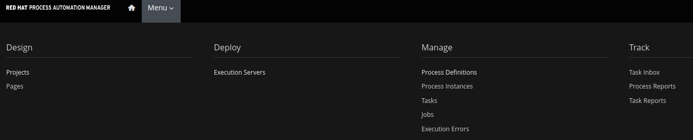

:scrollbar:

:toc2:
:order_fulfillment: link:https://github.com/gpe-mw-training/rhpam-order-fulfillment[order fulfillment]
:ocp_web_console: link:https://docs.openshift.com/container-platform/3.9/architecture/infrastructure_components/web_console.html#project-overviews[OpenShift Container Platform web console]
:ocp_cli_logs: link:https://docs.openshift.com/enterprise/3.0/cli_reference/basic_cli_operations.html#troubleshooting-and-debugging-cli-operations[OpenShift Container Platform CLI logs]
:jbpm_executor: link:http://docs.jboss.org/jbpm/release/7.0.0.Final/jbpm-docs/html_single/#_jbpm_executor[jbpm executor]
:stockwih: link:https://github.com/gpe-mw-training/rhpam-order-fulfillment/blob/master/src/main/java/org/acme/order_fulfillment/StockReviewMockWih.java[StockReviewMockWih]
:magic_error_handling: link:http://mswiderski.blogspot.com/2017/06/execution-error-how-to-deal-with.html[Maciej's blog, Execution error - how to deal with unexpected in jBPM 7.1]
:stockwih_1: link:https://github.com/gpe-mw-training/rhpam-order-fulfillment/blob/master/src/main/java/org/acme/order_fulfillment/StockReviewMockWih.java[StockReviewMockWih]

== Monitoring Lab

In this lab, you work with existing projects to observe the monitoring tools and dashboards available out of the box with Red Hat Process Automation Manager.

.Goals
* Filter process instances
* Filter tasks
* Observe changes via process and task monitoring

:numbered:

== Prepare Project to Monitor

In this section, you prepare a project that can be easily monitored. A project that showcases the managing and monitoring capabilities has the following characteristics:

* The process definition is annotated with a service level agreement (SLA) due date.
* The process has human tasks.
* The process causes an exception that can be fixed.

You import the {order_fulfillment} project shown below for this purpose:

image:images/order-fulfillment-process.png[]

. Import the {order_fulfillment} project into Business Central.
. Once you see an alert indicating that indexing is completed, deploy the `order-fulfillment` project:
+


+
[NOTE]
====
* You can toggle the visibility of alerts by clicking *View Alerts* or *Hide Alerts* in the top right:
+
image:images/alerts-button.png[]
* Alerts appear below the *Assets* list.
* You can also resize the *Alerts* section by dragging the top margin up or down.
====

. Confirm that the `order-fulfillment` deployment unit is running in the runtime server:
+
image:images/order-fulfillment-deployment.png[]

+
[NOTE]
====
* You may see a different number of deployment units in your list.

* You may have noticed already that the deployment process takes up to a couple of minutes, depending on the size of the KJAR to be implemented in the KIE server and network latency. It is not "immediate deployment" measured in milliseconds, so please be patient. You can monitor the `kie-server` logs using the {ocp_web_console} or the {ocp_cli_logs} if you want to observe its progress.
====

== Monitor Process Instances

Previously, you used the *Manage* option to start and analyze process instances. In this section, you use the monitoring tools to observe changes based on the actions performed with process instances.

=== Monitor Shortest Path

. Open the *order_fulfillment* process from the `order-fulfillment` project, and note the path that is followed when stock is available to fulfill the product order:
+
image:images/in_stock_process.png[]

* Here, when the `Article Available` gateway evaluates to `Yes`, the flow continues to the `Package and Ship` human task, and once that task is completed, the process instance is complete.

. Create a process instance that follows this path by default:
.. Navigate to *Manage -> Process Definitions*:
+


.. Click  in the *order_fulfillment* row, and select *Start*:
+
image:images/start-process-instance.png[]

.. In the *ProductName* field, enter `IN_STOCK`.
** This is a product in the process instance that follows the `Article Available` path.
.. Click *Submit*.

. Next, observe the state of the process instance:

.. Navigate to *Track -> Process Reports*.
.. Review the *Active Processes*.
** Expect to see your `order_fulfillment` process reflected in the charts:

+
image:images/order_fulfillment_monitor_1.png[]

+
[NOTE]
====
This dashboard may be combined with the results of the previous lab executions, showing more color. The important thing to note is the addition of `order_fulfillment` to the mix.
====
.. Hover over *Processes By Type*.
** Expect to see the number `1` for your `order_fulfillment` process.

. Navigate to *Manage -> Tasks* and click the *Package and Ship* task.
* Expect it to display a *Ready* status:
+
image:images/package-and-ship-1.png[]

. Claim, start, and complete the task using any values for *Shipping Address* and *Tracking Number*.

. Monitor the *Process Reports* and note the *Completed Process* value.
. Monitor the *Task Reports* and note that `1` task was completed for the `order_fulfillment` process:
+
image:images/order_fulfillment_monitor_2.png[]

=== Monitor Red Path

The lab environment includes the process characteristics to cause an error that can be fixed. When you enter `ERROR` for the product name, the first node, `Stock Review`, fails and you need to troubleshoot and fix the process instance.

. Start a process instance with `ERROR` in the *ProductName* field:

+
image:images/error-request.png[]

. Go to *Process Reports* and confirm one additional active process for your `order_fulfillment` process instance:
+
image:images/order_fulfillment_monitor_3.png[]

* Expect to see that one is completed and one is active.

. Navigate to *Manage -> Process Instances* and observe that the active `order_fulfillment` process instance has four errors:

+


* The `Stock Review` activity throws a single error each time it is executed with the `ERROR` product name. This means that `Stock Review` has been executed four times.

* `Stock Review` has been configured as an asynchronous task: A component in the engine called the `{jbpm_executor}` retries the activity the default number of three times. You can configure the number and frequency of retries in the server properties.

. Click *4* in the *Errors* cell in the `order_fulfillment` process instance row.
* The filter configuration changed and the *Manage* drop-down now shows the four execution errors for your process instance:

+
image:images/errors-process-instance-2.png[]

. Click one of the rows and analyze the details provided in Business Central.
. Note the root cause of the error:

+
```
Caused by: java.lang.RuntimeException: Error while stock review
	at org.acme.order_fulfillment.StockReviewMockWih.executeWorkItem(StockReviewMockWih.java:48)
```
. Confirm and observe the functionality by looking at the {stockwih} source code in GitHub.
. Read line 48 as indicated in the error detail and note that it throws an exception if the product name is "ERROR":
+
----
if ("ERROR".equalsIgnoreCase(po.getProductName()))
  throw new RuntimeException("Error while stock review");
----


. Click *X* in the top right corner of Business Central to close the error details and return to the error list for the process instance.
. Click  on one of the rows and select *Acknowledge*:

+


. Click  on a different row and select *View process*.
* Note that the number of errors for the process instance has decreased.

+
[NOTE]
====
By definition, every error that is caught and stored is unacknowledged, which means it is to be handled by someone or something (in the case of automatic error recovery). This approach allows you to filter on existing errors and see if they have been taken care of or not. When an error is acknowledged, the user and a time stamp are recorded to allow for tracing. Thus, the number of errors shown reflects the number of errors that have _not_ been acknowledged.
====

. Click  for the process instance, select *Abort*, and confirm the abort action.

. In *Process Reports*, confirm that a report of the aborted process is displayed:

+
image:images/order_fulfillment_monitor_4.png[]

. Navigate to *Manage -> Execution Errors*, and note that three errors are still not acknowledged.
. Acknowledge the three errors.

+
[NOTE]
====
Even if the process instance is in a completed state, or as in this case, an aborted state, the execution errors still need to be reviewed, troubleshot, handled, and acknowledged. There are means for automating the acknowledgment of a high volume of errors. For more information, see {magic_error_handling}.
====

=== Fix Red Path
In this section, you fix the issue that is causing the failure--the *ProductName*.

. Create another `ERROR` process instance.
. Click  in the `Error` process instance row and select *View jobs*:
+


* Expect to see that the process instance has one job.

. Click image:images/columns-button.png[] (*Columns*) at the top right corner of the jobs list and make sure that *Status* is selected:
+


* Now the *Status* of the job is `Error`.

. Click  in the job row and select *View process*.

+
[NOTE]
====
The `Executor` component creates a job to retry the operation when an error is found during or after an asynchronous task. The positive path for job status is *Queued -> Running -> Completed*. Other statuses that can be assigned to a job are *Canceled* and *Error*. The *Retrying* status is assigned to the job by the engine.
====

. Acknowledge the four errors from the process instance.

. Requeue the job and note that a new error is logged in the process instance because you have not fixed the data.

. Acknowledge the new error.

. Go back to *Manage -> Process Instances* and click the `order_fulfillment` process instance row.

. Select the *Process Variables* tab:

+
image:images/process-variables-tab-error.png[]

. In the *productName* row, click *Edit* and replace `ERROR` with `IN_STOCK`, and then click *Save*:

+


. Go back to *Manage -> Process Instances* and select *View jobs* from the `order_fulfillment` process instance row.
* Note that the job still has a status of *Error*.

. Requeue the job and observe that after the action, its status changes to *Completed*.

. Select *View process* for the job, and from the process instance, select the *Diagram* tab.
* Now the process instance is waiting for the `Package and Ship` human task:

+


. Locate the `Package and Ship` task, then claim, start, and complete the task.

. Return to the monitoring tools to confirm a new *Completed* task and a new *Completed* process instance for the `order_fulfillment` process.

=== Load Volume

In this section, you use a `curl` command operation to send multiple process instance requests and monitor the execution of the process instances and tasks.

The {stockwih_1} code is configured to randomly select a product name from a dictionary that is already available in the `kie-sever` instance in OpenShift. The random operation also creates `ERROR` elements in its options, causing the behavior described in previous sections.

==== Load Individual `RANDOM` Process Instances

First, you start an individual product order with `RANDOM` as the product name in order to observe the results.

. Start an `order_fulfillment` process instance using `RANDOM` as the value in the *ProductName* field:

+


. Review the started process instance log and diagram to resolve any errors and human tasks created by the `random` operation.

. Repeat this procedure a couple of times to familiarize yourself with the different random results as described below:
+
[cols="1,2,2",options="header"]
|=======================================
|Node|Random Value|Process Flow Description
|`Stock Review`| `IN_STOCK` or `RANDOM` product name with in-stock flag set to `true` a| * Activates only the `Package and ship` human task.
 * Claim, start, and complete the human task to complete the process instance.
|`Stock Review`| `ERROR` product name or `RANDOM` product name a| * Logs the error to *Manage Execution Errors* screen.
* Acknowledge the errors.
* When retrying a `RANDOM`, the second try may retrieve an actual product name instead of repeating the error, thus fixing the job execution.
* If `RANDOM` generates an error three times, then a job is created and retrying the job with `RANDOM` may release the process instance for the next step.
|`Stock Review`| `RANDOM` product name with in-stock flag set to `false` a| * Starts a `Procurement` subprocess.
|`Supplier Stock Review`| `RANDOM` days to deliver (less than two days) a| * Executes the `Order From Supplier` REST web service simulation and starts an `Inventory supplier reception` human task.
* Claim, start, and complete the human task.
* This creates a new `Package and Ship` human task that you also need to claim, start, and complete in order to complete the process instance.
|`Supplier Stock Review`| `RANDOM` days to deliver (more than two days) a| * Signals the `Inform Customer` task for email simulation, executes the `Order From Supplier` REST web service simulation, and starts a `Inventory supplier reception` human task.
* Claim, start, and complete the human task.
* This creates a new `Package and Ship` human task that you also need to claim, start, and complete in order to complete the process instance.
|`Supplier Stock Review`| `RANDOM` undeliverable flag a| * Cancels the subprocess execution and handles the `Undeliverable` business exception with an email and web service simulation.
* No further actions to perform.
|=======================================

==== Load Multiple `RANDOM` Process Instances

In this section, you use the following `curl` UNIX command to load multiple `RANDOM` process instances through the REST API over HTTP for the KIE Server:

----
for i in {1..100}; do \  <1>
echo "-"; \   <2>
curl -X POST "http://localhost:8080/services/rest/server/containers/order-fulfillment/processes/org.acme.order_fulfillment.order_fulfillment/instances" -H "accept: application/json" -H "content-type: application/json" --user adminUser:test1234! -d "{\"productName\":\"RANDOM\"}"; \   <3>
done  <4>
----

<1> This line starts the for loop that repeats the command 100 times. If you want to start 50 instances instead, this is where you make that change to the command.

<2> This line creates separation in the console output.

<3> This line contains the URL, authentication, process definition, and data for the `curl` command that interacts with the KIE Server. The HTTP address here varies depending on where you are executing the command from.

<4> This line closes the loop for the execution.


Next, you execute the `curl` command to start and load 100 process instances.

. Log in to OpenShift Container Platform.

. From the *Overview* page, expand the `rht-kieserver` deployment configuration:

+


. Click the pod (blue circle).

. Select the *Terminal* tab:

+


. In the terminal, enter the following command to load 100 process instances:

+
----
for i in {1..100}; do \
echo "-"; \
curl -X POST "http://localhost:8080/services/rest/server/containers/order-fulfillment/processes/org.acme.order_fulfillment.order_fulfillment/instances" -H "accept: application/json" -H "content-type: application/json" --user adminUser:test1234! -d "{\"productName\":\"RANDOM\"}"; \
done
----

+


* The terminal logs the process instance IDs as it starts them.

+
[TIP]
====
You can use your local machine to execute this command, but instead of `http://localhost:8080`, you use one of the external traffic routes for the `kie-server` described in the deployment configuration:


For this option, you need a macOS terminal that knows what `curl` means.
If you use the secure route (HTTPS), remember to add `--insecure` to the `curl` command.
====

. Go to *Process Reports* in Business Central and expect to see more than 100 total processes:

+
image:images/hundred-process-instances.png[]

. From *Process Reports*, select *View table* in the top right corner:

+


. Click the *Duration* column header to sort the table by this column.

=== Complete Process Instances

Remember that in order to complete these process instances you need to complete the human tasks. In this section, you use the following `curl` command to complete the human tasks:

----
for i in {1..100}; do \
curl -X PUT "http://localhost:8080/services/rest/server/containers/order-fulfillment/tasks/$i/states/completed?auto-progress=true" -H "accept: application/json" -H "content-type: application/json" --user adminUser:test1234! -d "{}"; \
done
----

Note that in the `curl` command you use the task ID as part of the URL (`$i`). For this command to work, you need to know the range of task IDs that you want to complete.

. In Business Central, navigate to *Manage -> Tasks*.

. Using the column configuration options for the tasks list, add the *Id* column:
+


. Sort by ascending ID and make a note of the smallest task ID:
+


. Sort by descending ID and make a note of the largest task ID:
+


. Return to the `kie-server` pod terminal and execute the `curl` command using your numbers:
+
----
for i in {7..88}; do \
curl -X PUT "http://localhost:8080/services/rest/server/containers/order-fulfillment/tasks/$i/states/completed?auto-progress=true" -H "accept: application/json" -H "content-type: application/json" --user adminUser:test1234! -d "{}"; \
done
----
+
[NOTE]
====
* Your numbers may be different than the ones used in this example.
* Also note that this command takes a few seconds to return.
====

. Go to *Task Reports* in Business Central and observe the changes:

+


* Note that there are still some tasks in the *Ready* status.
* This is due to the second set of human tasks that were created after the `Inventory supplier reception` task in the `procurement` subprocess.

. Repeat Steps 1-5 above to complete them.
+
.Sample Command
----
for i in {89..114}; do \
curl -X PUT "http://localhost:8080/services/rest/server/containers/order-fulfillment/tasks/$i/states/completed?auto-progress=true" -H "accept: application/json" -H "content-type: application/json" --user adminUser:test1234! -d "{}"; \
done
----

. Confirm that all of the tasks for the `order_fulfillment` process instance are complete.

== Use Process Instance SLA

. In Business Central, navigate to *Manage -> Process Instances*.
. From the *State* filters in the left-hand panel, select *Completed*:

+


. Click image:images/columns-button.png[] (*Columns*) and select *SLA Compliance*:

+
image:images/sla-compliance-column.png[]

. Sort the Process Instances list by *SLA Compliance* in ascending, then descending order.

. Find where the SLA Compliance due date was configured in the process definition:
.. From *Projects* view, select the `order_fulfillment` process.
.. Analyze the process definition properties and find the *SLA Due Date* (set to 15 minutes):
+
image:images/sla-due-date.png[]
