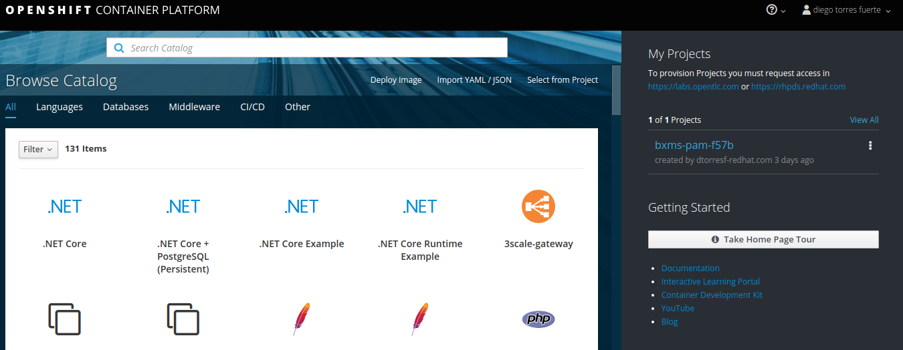
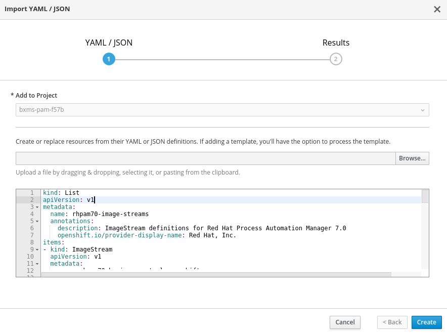
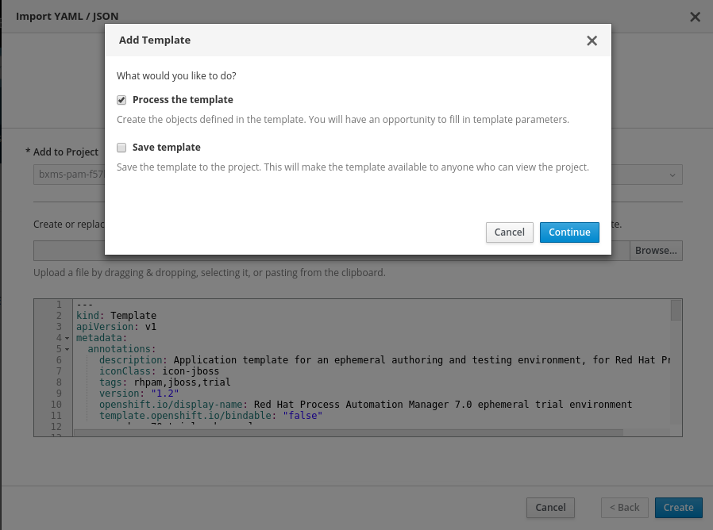
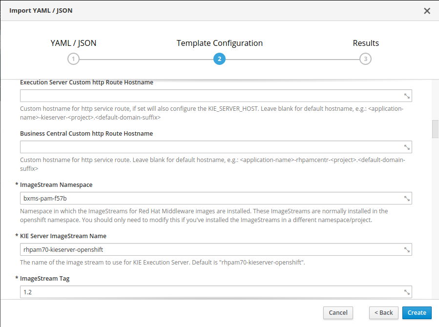
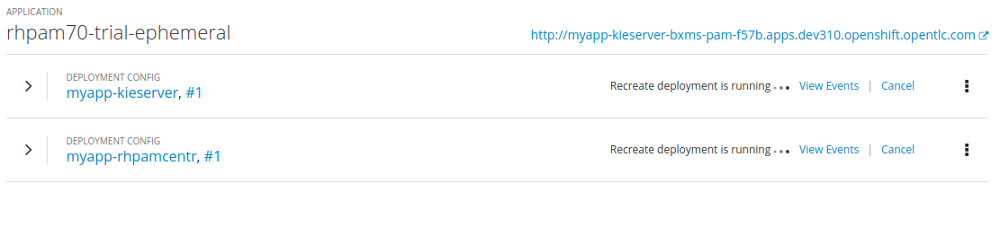

:scrollbar:

:toc2:
:pam_template: link:https://raw.githubusercontent.com/gpe-mw-training/bxms_decision_mgmt_foundations_lab/master/resources/rhdm7-only.yaml[Process Automation Manager template]

== Process Automation Manager Provisioning Lab

.Goal
* Provision Red Hat Process Automation Manager in an OpenShift environment

:numbered:

== Overview

Red Hat Process Automation Manager can be provisioned in either of the following environments:

* Any combination of JVM, OS, and application container detailed in the link:https://access.redhat.com/articles/3354301[Red Hat Process Automation Manager Support Configurations document].
+
** The installation procedure for this approach can be found in the link:https://access.redhat.com/documentation/en-us/red_hat_decision_manager/7.0/html-single/installing_red_hat_decision_manager_on_premise/index[product documentation].
+
[NOTE]
====
This lab does not discuss this installation approach.
====
* An OpenShift Container Platform environment. The focus of this lab is on this approach.

** Related documentation on this installation procedure can also be found link:https://access.redhat.com/documentation/en-us/red_hat_decision_manager/7.0/html-single/deploying_red_hat_decision_manager_on_red_hat_openshift_container_platform/index[here].

** Process Automation Manager is provisioned in a single remote OpenShift project. For the purposes of this lab, this single remote OpenShift project is provided to you; you do not need to install the OpenShift Container Platform.

== Review Process Automation Manager Templates

Red Hat Process Automation Manager includes a variety of OpenShift templates that define all of the artifacts to be provisioned for a Process Automation Manager deployment.

.OpenShift Templates
[cols="1,2,2",options="header",caption="" ]
|=======================================
|Template|Description|Technical Content
|`rhpam70-authoring.yaml` |An example of a recommended authoring environment for most customers where scalability and reliability requirements do not rise to levels justifying a high-availability setup. |A single replica of Business Central configured to use a persistent volume, set up to integrate tightly with an instance of the KIE server, using Business Central as its Maven repository, and persisting process data to H2, backed by a persistent volume.
|`rhpam70-authoring-ha.yaml` |An example of a recommended highly-available authoring environment for most customers requiring significant scalability and reliability. |Two default replicas of Business Central running on a Red Hat JBoss EAP cluster, using Elasticsearch and Red Hat AMQ, and configured with a shared persistent volume set up to tightly integrate with two replicas of the KIE server, using Business Central as its Maven repository and persisting process data to PostgreSQL.
|`rhpam70-sit.yaml` |An example of a recommended integration testing environment for most customers. |A single replica of Business Central Monitoring connected to Smart Router, configured for two distinct sets of KIE servers, configured with an external Maven repository and persisting to different instances of PostgreSQL.
|`rhpam70-prod.yaml` |An example of a recommended production environment, with the expectation that a majority of current customers run something very similar. |Three default replicas of Business Central Monitoring configured for single sign-on with RH-SSO integration, connected to two replicas of Smart Router, configured for two distinct sets of KIE servers, pointing to an external Maven repository and persisting to different instances of PostgreSQL.
|`rhpam70-prod-immutable-monitor.yaml` |An example of a recommended production environment for an expected minority of customers who want to run immutable containers that cannot be managed. |Three default replicas of Business Central Monitoring configured for single sign-on with RH-SSO integration, connected to two replicas of Smart Router, configured for connection to distinct sets of S2I KIE server images using container-local Maven data that can be created through an associated template.
|`rhpam70-prod-immutable-kieserver.yaml` |An immutable KIE server optionally connecting to a monitoring console. |Two replicas of KIE server using S2I to generate container-local Maven data and persisting to PostgreSQL. Optionally, this may point to Smart Router and/or monitoring.
|`rhpam70-trial-ephemeral.yaml` |A short-lived trial environment that can be quickly and easily installed. |Business Central with an ephemeral local Git repository tightly coupled to a KIE server using an ephemeral H2 database and pointing to Business Central as its Maven service.
|`rhpam70-kieserver-postgresql.yaml` |An example of a managed KIE server used with a monitoring console. |A single replica of KIE server with the required configuration to use an external Maven service and included PostgreSQL database. Optionally, this may point to Smart Router.
|`rhpam70-kieserver-mysql.yaml` |An example of a managed KIE server used with a monitoring console. |Single replica of KIE server with the required configuration to use an external Maven service and included MySQL database. Optionally, this may point to Smart Router.
|`rhpam70-kieserver-externaldb.yaml` |An example of a managed KIE server used with a monitoring console. |Single replica of KIE server with the required configuration to use an external Maven service, and the required configuration to persist to an external database. Optionally, this may point to Smart Router.
|=======================================

You can find these templates link:https://github.com/jboss-container-images/rhpam-7-openshift-image/tree/7.0.2.GA/templates[here].

== Add New Application

In this section, you add a new application to Process Automation Manager in your existing OpenShift Container Platform lab environment.

. In your browser, navigate to the master host of your OpenShift environment and log in:
+

. From the Catalog's menu, select *Import YAML/JSON*:
+

. Copy and paste the contents of the link:https://raw.githubusercontent.com/jboss-container-images/rhpam-7-openshift-image/7.0.2.GA/rhpam70-image-streams.yaml[image-streams file] into the text box:
+

. Make a note of the value in the read-only *Add to project* field--you use this value later as your OpenShift provisioned project name.
. Once the *Create* button is enabled, click it and confirm the resource creation.

. Repeat the import operation for the link:https://raw.githubusercontent.com/jboss-container-images/rhpam-7-openshift-image/7.0.2.GA/templates/rhpam70-trial-ephemeral.yaml[rhpam70-trial-ephemeral template].
. In the *Add Template* pop-up, ensure that the *Process the Template* box is checked and then click *Continue*:
+

. Change the value of the following template parameter:
* *ImageStream namespace*: Your OpenShift provisioned project name--for example `bxms-pam-f57b`
+

. Click *Create* and confirm creation.

== Verify Application

. Return to the homepage of your manually provisioned Process Automation Manager project.
. Note that in the *Overview* page, a new application called `rhpam70-trial-ephemeral` has been created:
+

. Once the deployments for the application are complete, access Business Central and the KIE server routes as you have in the previous labs in this course, using `RedHat` as your `adminUser` password.

== Conclusion

You have now provisioned Process Automation Manager in an OpenShift Container Platform environment.
